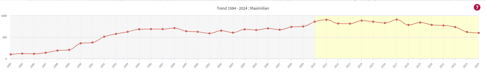
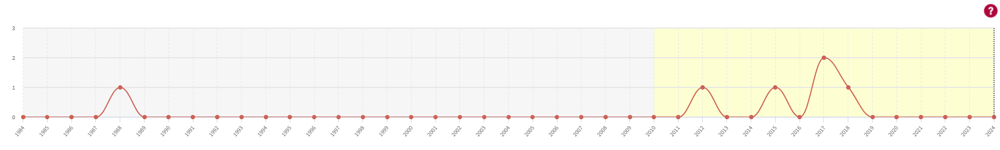
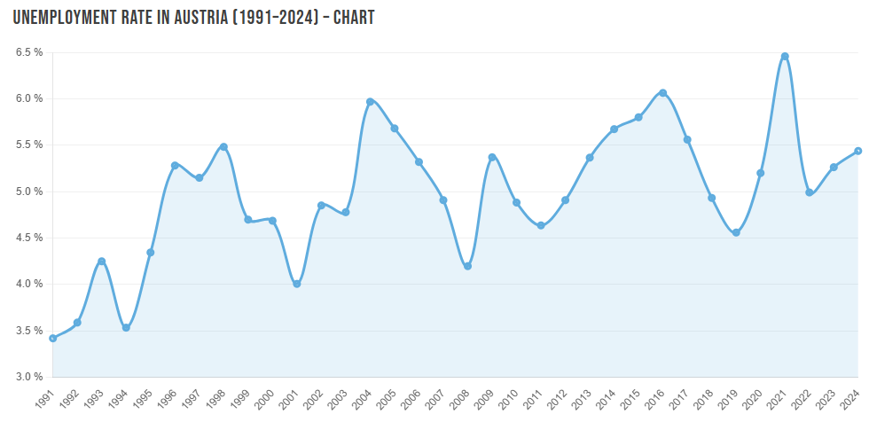
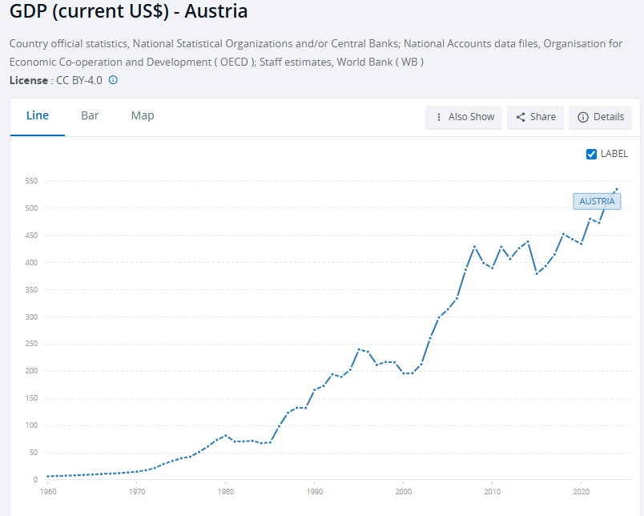
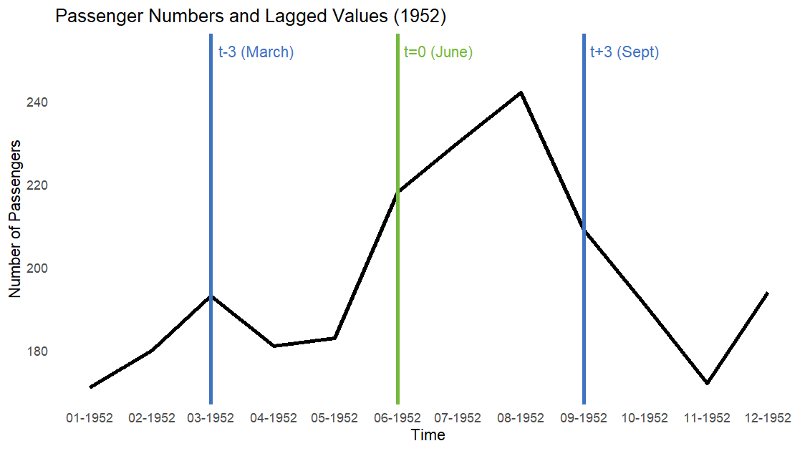
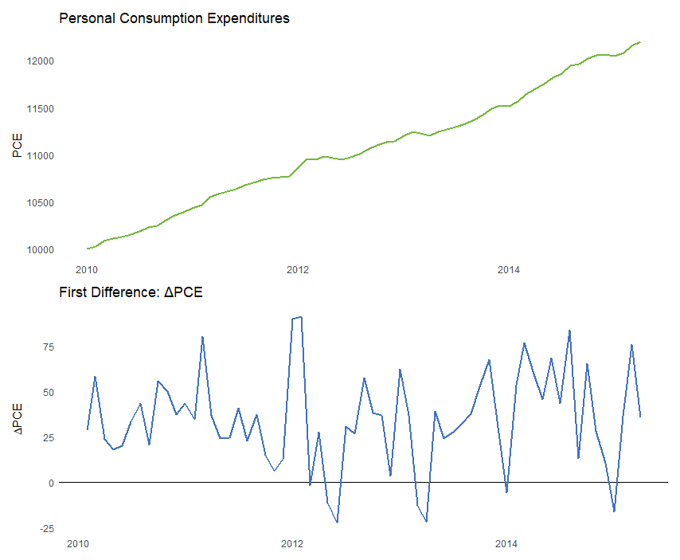
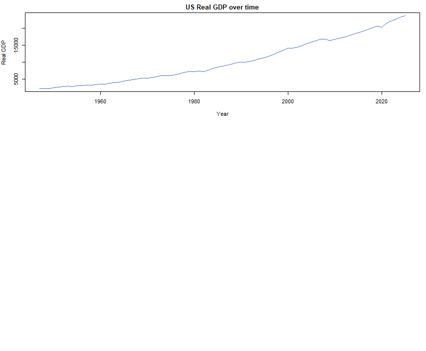
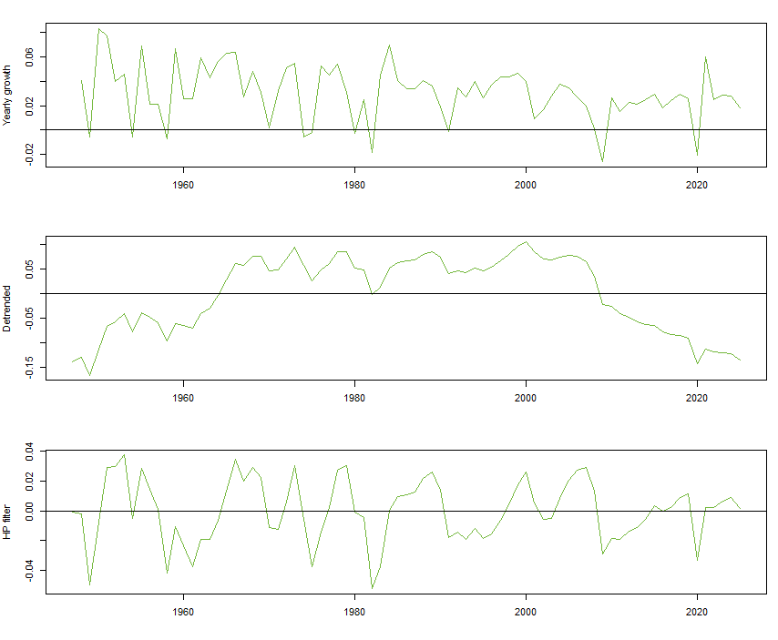
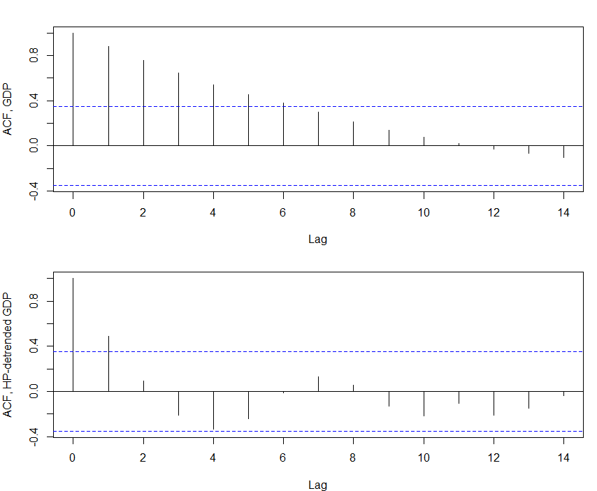

# Introduction

## Time Series Data

* [**Time series data**]{.col1}: Data collected for a single entity at multiple points in time.
* This data type can be used to answer quantitative questions for which cross-sectional data are inadequate.
* [**Dynamic causal effect**]{.col2} of variable X on dependent variable Y over time.
* [**Example**]{.col3}: What is the effect of a law requiring passengers to wear seatbelts on traffic fatalities?
* [**Forecasting**]{.col2} the value of a variable at a later date.
* [**Example**]{.col3}: What will next month's inflation rate be?
* Using time series data allows us to extend the questions we can now answer. However, it poses special challenges, and overcoming them requires new techniques.

## Examples: Baby's Name 

:::{.centering}

:::

:::{.centering}

:::

## Examples: Unemployement in Austria

:::{.centering}

:::

## Examples: GDP in Austria

:::{.centering}
{width="60%"}
:::

# Notation and basic concepts

## Time Series

* Time series data are observations indexed according to [**time**]{.col1}.
* It implies that the index has an [**ordering**]{.col1}. Observations are not exchangeable.
* The observation on the time series variable $Y$ made at date $t$ is denoted [**$Y_t$**]{.col2}.
* The total number of observations is denoted $T$.
* The interval (of time) between observation $t$ and $t+1$ is some unit of weeks, months, quarters, or even years.

## Lags

* Special terminology and notation are used to indicate future and past values of $Y$.
* The value of $Y$ in the previous period is called its [**first lagged value**]{.col2} or [**first lag**]{.col2}, and is denoted [**$Y_{t-1}$**]{.col2}.
* Its [**j-th lagged value**]{.col1} is its value $j$ periods ago, denoted [**$Y_{t-j}$**]{.col1}.
* Similarly, $Y_{t+1}$ denotes the value of $Y$ one period into the future.

:::{.centering}
{width="50%"}
:::

## First Differences

* The change of value of $Y$ between period $t-1$ and $t$ is $Y_{t}-Y_{t-1}$
* We call it the [**first difference**]{.col2} in the variable $Y_t$
* We will use the following notation: $\Delta Y = Y_t - Y_{t-1}$

:::{.centering}
{width="45%"}
:::

## Detrending: Fixed and Random Variation
Time series methods focus on modelling [**random components**]{.col2}.But, there may also be [**fixed variation**]{.col2}: seasonality of GDP, or weekday e ects.

We are looking to remove fixed components (such as a trend or seasonal patterns) and focus on random components of a time series. There are many ways to achieve his: 
 
* [**growth rates**]{.col1} (e.g. year-to-year, quarter-to-quarter)
* [**linear trends**]{.col1} (e.g. linear growth, demeaning seasons)
* [**filters**]{.col1} (e.g. bandpass filter, Hodrick-Prescott filter)

For example, many economic time series are analyzed after computing their (change in) logarithms, as they exhibits exponential growth. 

:::{.centering}
{width="60%"}
:::

## Detrending: Examples
:::{.centering}
{width="60%"}
:::

## Autocorrelation in time series regressions

Consider the linear model and related assumptions:

$$
y = X\beta + e, \qquad e \sim \mathcal{N}(0,\sigma^2).
$$

1. $\mathbb{E}[e]=0$,
2. $\mathrm{Var}(e)=\sigma^2$, and
3. $\mathrm{Cov}(e_t,e_s)=0 \ \text{for all } t \neq s$.

When $y$ and $X$ are time series, assumption (3) is often violated. We need a sensible alternative.

## Autocorrelation

* In time serie, the value of $Y$ in one period is typically correlated with its value in the next period.
* The correlation of a serie with its own lagged values is called [**autocorrelation**]{.col2}.
* The first [**autocorrelation**]{.col2} is the correlation between $Y_t$ and $Y_{t-1}$ 
* The j-th [**autocorrelation**]{.col2} is the correlation between $Y_t$ and $Y_{t-j}$
* The j-th [**autocovariance**]{.col1} is the covariance between $Y_t$ and $Y_{t-j}$

$$
\text{$j^{\text{th}}$ autocovariance} \;=\; \operatorname{cov}(Y_t, Y_{t-j})
$$

$$
\text{$j^{\text{th}}$ autocorrelation} \;=\; \rho_j \;=\; \operatorname{corr}(Y_t, Y_{t-j})
\;=\; \frac{\operatorname{cov}(Y_t, Y_{t-j})}{\sqrt{\operatorname{var}(Y_t)\operatorname{var}(Y_{t-j})}}
$$

## Autocorrelation function

The autocorrelation function (ACF) is a useful summary for a stationary time series. It is defined as:

$$
\mathrm{ACF}(j) \;=\; \rho_j
\;=\; \operatorname{corr}(Y_t, Y_{t-j})
\;=\; \frac{\operatorname{cov}(Y_t, Y_{t-j})}{\operatorname{var}(Y_t)}.
$$

The ACF is a common diagnostic tool that reveals interesting patterns of autocorrelation, but it may also indicate a lack of stationarity.

## Autocorrelation of GDP

:::{.centering}
{width="60%"}
:::

## Durbin-Watson Statistic

* We can test for autocorrelation using the [**Durbin-Watson statistic**]{.col2}:
$$
d = \frac{\sum_{t=2}^{T}\left(\hat{e}_t - \hat{e}_{t-1}\right)^2}{\sum_{t=1}^{T}\hat{e}_t^{\,2}}.
$$
* A value of [**$d = 2$**]{.col1} indicates no autocorrelation. 
* The statistic is bounded as $d \in [0,4]$ 
* Values smaller than two may indicate positive autocorrelation.
* Values larger than two may indicate negative autocorrelation.

## Stationarity 

* Time series forecasts use data on the [**past**]{.col2} to forecast the [**future**]{.col2}. 
* Doing so presumes that the [**future is similar to the past**]{.col2} (in the sense that the correlations) 
* More generally the [**distributions**]{.col1}, of the data in the future will be like they were in the past.
* In the context of regression with time series data, the idea that historical relationships can be generalized to the future is formalized by the concept of [**stationarity**]{.col1}. 
* Definition of [**stationarity**]{.col1}: The probability distribution of the time series variable does not change over time. 
* Under the assumption of [**stationarity**]{.col1}, regression models estimated using [**past data**]{.col2} can be used to forecast [**future values**]{.col2}
* Stationarity can fail to hold for multiple reasons, in which case the time series is said to be [**nonstationary**]{.col1}

# References

## References

 

::: {#refs}
:::
