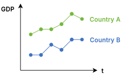
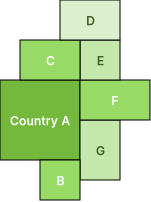
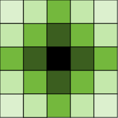
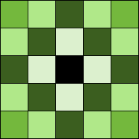
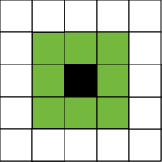
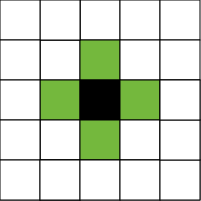
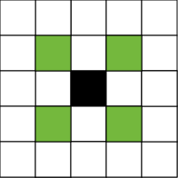
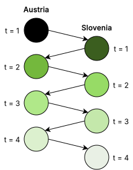




```{r}
#| label: setup
#| include: false
library(plotly)
font_family <- "Inter" 
```

# Introduction

## Time Series Data

* [**Time series data**]{.col1}: Data collected for a single entity at multiple points in time.
* This data type can be used to answer quantitative questions for which cross-sectional data are inadequate.
* [**Dynamic causal effect**]{.col2} of variable X on dependent variable Y over time.
* [**Example**]{.col3}: What is the effect of a law requiring passengers to wear seatbelts on traffic fatalities?
* [**Forecasting**]{.col2} the value of a variable at a later date.
* [**Example**]{.col3}: What will next month's inflation rate be?
* Using time series data allows us to extend the questions we can now answer. However, it poses special challenges, and overcoming them requires new techniques.


## Examples: Baby's Name 

```{r}
#| fig-width: 13
#| fig-height: 6.5
#| warning: false
#| message: false

library(plotly)
library(dplyr)

style_plotly_scale <- function(p, scale = 1.5, family = "Inter, sans-serif") {
  sz <- list(
    base   = 14 * scale,
    title  = 16 * scale,
    tick   = 12 * scale,
    annot  = 16 * scale,
    legend = 12 * scale,
    hover  = 12 * scale
  )
  p |>
    layout(
      font        = list(family = family, size = sz$base),
      title       = list(font = list(family = family, size = sz$title)),
      xaxis       = list(tickfont = list(family = family, size = sz$tick)),
      xaxis2      = list(tickfont = list(family = family, size = sz$tick)),
      yaxis       = list(tickfont = list(family = family, size = sz$tick)),
      yaxis2      = list(tickfont = list(family = family, size = sz$tick)),
      legend      = list(font = list(family = family, size = sz$legend)),
      hoverlabel  = list(font = list(family = family, size = sz$hover)),
      uniformtext = list(minsize = sz$base, mode = "show")
    )
}

# Parse the data
df <- data.frame(
  Year = 1984:2024,
  Maximilian = c(100,118,113,138,189,205,357,376,510,575,624,684,688,687,711,638,624,588,652,605,682,666,703,673,737,748,860,904,817,813,884,860,829,908,783,841,786,771,735,620,599),
  Sannah = c(0,0,0,0,1,0,0,0,0,0,0,0,0,0,0,0,0,0,0,0,0,0,0,0,0,0,0,0,1,0,0,1,0,2,1,0,0,0,0,0,0)
)

# Set ranges
xr <- c(min(df$Year) - 1, max(df$Year) + 1)
yr_max <- c(0, max(df$Maximilian) + 50)
yr_san <- c(-0.3, max(df$Sannah) + 0.5)

p <- plot_ly() |>
  # Top panel: Maximilian
  add_lines(x = df$Year, y = df$Maximilian,
            line = list(color = "#4072c2", width = 5),
            hoverinfo = "x+y", name = "Maximilian",
            xaxis = "x", yaxis = "y") |>
  # Bottom panel: Sannah
  add_lines(x = df$Year, y = df$Sannah,
            line = list(color = "#74b83d", width = 5),
            hoverinfo = "x+y", name = "Sannah",
            xaxis = "x2", yaxis = "y2") |>
  layout(
    showlegend = FALSE,
    # Top panel x-axis (hidden tick labels)
    xaxis = list(
      domain = c(0, 1),
      anchor = "y",
      range = xr,
      zeroline = FALSE,
      showgrid = FALSE,
      showticklabels = FALSE,
      title = ""
    ),
    # Top panel y-axis
    yaxis = list(
      domain = c(0.55, 1),
      anchor = "x",
      range = yr_max,
      zeroline = TRUE,
      zerolinecolor = "darkgray",
      zerolinewidth = 1,
      showgrid = FALSE,
      title = "Newborns",
      linecolor = "darkgray",
      linewidth = 1
    ),
    # Bottom panel x-axis
    xaxis2 = list(
      domain = c(0, 1),
      anchor = "y2",
      range = xr,
      zeroline = FALSE,
      showgrid = FALSE,
      title = ""
    ),
    # Bottom panel y-axis
    yaxis2 = list(
      domain = c(0, 0.45),
      anchor = "x2",
      range = yr_san,
      zeroline = TRUE,
      zerolinecolor = "darkgray",
      zerolinewidth = 1,
      showgrid = FALSE,
      title = "Newborns",
      linecolor = "darkgray",
      linewidth = 1
    ),
    annotations = list(
      list(x = 2005, y = 850, xref = "x", yref = "y",
           text = "<b>Maximilian</b>", showarrow = FALSE, xanchor = "left",
           font = list(size = 22, family = "Inter, sans-serif", color = "#4072c2")),
      list(x = 2005, y = 1.8, xref = "x2", yref = "y2",
           text = "<b>Sannah</b>", showarrow = FALSE, xanchor = "left",
           font = list(size = 22, family = "Inter, sans-serif", color = "#74b83d"))
    ),
    plot_bgcolor = "white",
    paper_bgcolor = "white"
  ) |>
  style_plotly_scale(scale = 1.6, family = "Inter, sans-serif") |>
  layout(autosize = FALSE, width = 13*96, height = 6.5*96) |>
  config(responsive = FALSE)

p
```


## Examples: Unemployement in Austria

:::{.centering}

:::

## Examples: GDP in Austria

:::{.centering}
{width="60%"}
:::


# Notation and basic concepts

## Time Series

* Time series data are observations indexed according to [**time**]{.col1}.
* It implies that the index has an [**ordering**]{.col1}. Observations are not exchangeable.
* The observation on the time series variable $Y$ made at date $t$ is denoted [**$Y_t$**]{.col2}.
* The total number of observations is denoted $T$.
* The interval (of time) between observation $t$ and $t+1$ is some unit of weeks, months, quarters, or even years.


## Lags

* Special terminology and notation are used to indicate future and past values of $Y$.
* The value of $Y$ in the previous period is called its [**first lagged value**]{.col2} or [**first lag**]{.col2}, and is denoted [**$Y_{t-1}$**]{.col2}.
* Its [**j-th lagged value**]{.col1} is its value $j$ periods ago, denoted [**$Y_{t-j}$**]{.col1}.
* Similarly, $Y_{t+1}$ denotes the value of $Y$ one period into the future.

:::{.centering}
{width="50%"}
:::


## First Differences

* The change of value of $Y$ between period $t-1$ and $t$ is $Y_{t}-Y_{t-1}$
* We call it the [**first difference**]{.col2} in the variable $Y_t$
* We will use the following notation: $\Delta Y = Y_t - Y_{t-1}$

:::{.centering}
{width="45%"}
:::


## Detrending: Fixed and Random Variation
Time series methods focus on modelling [**random components**]{.col2}.But, there may also be [**fixed variation**]{.col2}: seasonality of GDP, or weekday e ects.

We are looking to remove fixed components (such as a trend or seasonal patterns) and focus on random components of a time series. There are many ways to achieve his: 
 
* [**growth rates**]{.col1} (e.g. year-to-year, quarter-to-quarter)
* [**linear trends**]{.col1} (e.g. linear growth, demeaning seasons)
* [**filters**]{.col1} (e.g. bandpass filter, Hodrick-Prescott filter)

For example, many economic time series are analyzed after computing their (change in) logarithms, as they exhibits exponential growth. 

:::{.centering}
{width="60%"}
:::


## Detrending: Examples
:::{.centering}
{width="60%"}
:::

## Autocorrelation in time series regressions

Consider the linear model and related assumptions:

$$
y = X\beta + u, \qquad u \sim \mathcal{N}(0,\sigma^2).
$$

1. $\mathbb{E}[u]=0$,
2. $\mathrm{Var}(u)=\sigma^2$, and
3. $\mathrm{Cov}(u_t,u_s)=0 \ \text{for all } t \neq s$.

When $y$ and $X$ are time series, assumption (3) is often violated. We need a sensible alternative.


## Autocorrelation

* In time serie, the value of $Y$ in one period is typically correlated with its value in the next period.
* The correlation of a serie with its own lagged values is called [**autocorrelation**]{.col2}.
* The first [**autocorrelation**]{.col2} is the correlation between $Y_t$ and $Y_{t-1}$ 
* The j-th [**autocorrelation**]{.col2} is the correlation between $Y_t$ and $Y_{t-j}$
* The j-th [**autocovariance**]{.col1} is the covariance between $Y_t$ and $Y_{t-j}$

$$
\text{$j^{\text{th}}$ autocovariance} \;=\; \operatorname{cov}(Y_t, Y_{t-j})
$$

$$
\text{$j^{\text{th}}$ autocorrelation} \;=\; \rho_j \;=\; 
\;=\; \frac{\operatorname{cov}(Y_t, Y_{t-j})}{\sqrt{\operatorname{var}(Y_t)\operatorname{var}(Y_{t-j})}}
$$


## Autocorrelation function

The autocorrelation function (ACF) is a useful summary for a stationary time series. It is defined as:

$$
\mathrm{ACF}(j) \;=\; \rho_j
\;=\; \operatorname{corr}(Y_t, Y_{t-j})
\;=\; \frac{\operatorname{cov}(Y_t, Y_{t-j})}{\operatorname{var}(Y_t)}.
$$

The ACF is a common diagnostic tool that reveals interesting patterns of autocorrelation, but it may also indicate a lack of stationarity.


## Autocorrelation of GDP

:::{.centering}
{width="60%"}
:::

## Durbin-Watson Statistic

* We can test for autocorrelation using the [**Durbin-Watson statistic**]{.col2}:
$$
d = \frac{\sum_{t=2}^{T}\left(\hat{u}_t - \hat{u}_{t-1}\right)^2}{\sum_{t=1}^{T}\hat{u}_t^{\,2}}.
$$
* A value of [**$d = 2$**]{.col1} indicates no autocorrelation. 
* The statistic is bounded as $d \in [0,4]$ 
* Values smaller than two may indicate positive autocorrelation.
* Values larger than two may indicate negative autocorrelation.


## Stationarity 

* Time series forecasts use data on the [**past**]{.col2} to forecast the [**future**]{.col2}. 
* Doing so presumes that the [**future is similar to the past**]{.col2} (in the sense that the correlations) 
* More generally the [**distributions**]{.col1}, of the data in the future will be like they were in the past.
* In the context of regression with time series data, the idea that historical relationships can be generalized to the future is formalized by the concept of [**stationarity**]{.col1}. 
* Definition of [**stationarity**]{.col1}: The probability distribution of the time series variable does not change over time. 
* Under the assumption of [**stationarity**]{.col1}, regression models estimated using [**past data**]{.col2} can be used to forecast [**future values**]{.col2}
* Stationarity can fail to hold for multiple reasons, in which case the time series is said to be [**nonstationary**]{.col1}


# Autoregressions

## The First-Order Autoregressive Model
* An [**autoregression**]{.col2} expresses the conditional mean of a time series variable Yt as a linear function of its own lagged values.
* A [**first-order autoregression**]{.col2} uses only one lag of Y in this conditional expectation.


$$
\mathbb{E}\!\left(Y_t \mid Y_{t-1}, Y_{t-2}, \ldots \right) = \beta_0 + \beta_1 Y_{t-1}.
$$

* The [**first-order autoregression (AR(1))**]{.col2} model can be written in the familiar form of a regression model as

$$
Y_t = \beta_0 + \beta_1 Y_{t-1} + u_t,
$$

## The First-Order Autoregressive Model (2)

* The unknown population coefficients $\beta_0$ and $\beta_1$ can be estimated by [**ordinary least square (OLS)**]{.col1}. 
* How to estimate $\beta_0$ and $\beta_1$ might initially seem puzzling: Unlike a cross-sectional regression with $X$ on the right-hand side,we have $Y$ on both sides.
* The solution to this puzzle is to realize that the variable Yt−1 on the right-hand side differs 
from the dependent variable Yt because the regressor is the [**first lag**]{.col2} of Y. 
* That is, X is the [**first lag**]{.col2} of Y. 

## Forecasts and forecast errors
* If the population coefficients were known, then the one-step-ahead forecast of $Y_{T+1}$, made using data through date $T$, would be:
$$
\beta_0 + \beta_1 Y_T
$$
* Although $\beta_0$ and $\beta_1$ are unknown, we can use their [**OLS estimates**]{.col1} instead.
The forecast based on the [**AR(1) model**]{.col2} is:
$$
\widehat{Y}_{T+1\mid T} = \widehat{\beta}_0 + \widehat{\beta}_1 Y_T,
$$
* $\widehat{\beta}_0$ and $\widehat{\beta}_1$ are estimated using historical data through time $T$.
* The forecast error is: $Y_{T+1} - \widehat{Y}_{T+1\mid T}$

## The $p$th-Order Autoregressive Model
* The AR(1) model uses $Y_{t-1}$ to forecast $Y_t$, but doing so ignores potentially useful information in the more distant past. 
* One way to incorporate this information is to include additional lags in the AR(1) model; this yields the [**$p$th-order autoregressive model**]{.col2}.
* [**The model**]{.col2} represents $Y_t$ as a linear function of $p$ of its lagged values. 
* [**In the AR($p$) model**]{.col2}, the regressors are $Y_{t-1}, Y_{t-2}, \ldots, Y_{t-p}$, and intercept.
* The number of lags, $p$, included in an [**In the AR($p$) model**]{.col2} is called the [**order**]{.col1} (or [**lag length**]{.col1}) of the autoregression.

## The $p$th-Order Autoregressive Model (2)
The [**$p$th-order autoregressive (AR($p$))**]{.col2} model represents the conditional expectation of $Y_t$ as a linear function of $p$ of its lagged values:

$$
Y_t = \beta_0 + \beta_1 Y_{t-1} + \beta_2 Y_{t-2} + \cdots + \beta_p Y_{t-p} + u_t.
$$

If $Y_t$ follows an [**AR($p$)**]{.col2}, then the oracle one-step-ahead forecast of $Y_{T+1}$ based on $Y_T, Y_{T-1}, \ldots$ is

$$
Y_{T+1\mid T}
= \beta_0 + \beta_1 Y_T + \beta_2 Y_{T-1} + \cdots + \beta_p Y_{T-p+1}.
$$

## The Autoregressive Distributed Lag (ADL) Model

An [**autoregressive distributed lag (ADL)**]{.col2} model is:

- [**Autoregressive**]{.col2} because lagged values of the dependent variable $Y_t$ are included as regressors.
- [**Distributed lag**]{.col2} because the regression also includes multiple lags of an additional predictor $X_t$.

An [**ADL model**]{.col2} with $p$ lags of $Y_t$ and $q$ lags of $X_t$, denoted [**ADL($p,q$)**]{.col2}, is

$$
Y_t
= \beta_0 + \beta_1 Y_{t-1} + \beta_2 Y_{t-2} + \cdots + \beta_p Y_{t-p}
+ \delta_1 X_{t-1} + \delta_2 X_{t-2} + \cdots + \delta_q X_{t-q}
+ u_t.
$$

Here, $\beta_0,\beta_1,\ldots,\beta_p,\delta_1,\ldots,\delta_q$ are unknown coefficients and $u_t$ is the error term, with

$$
\mathbb{E}\!\left(u_t \mid Y_{t-1},Y_{t-2},\ldots,X_{t-1},X_{t-2},\ldots \right)=0.
$$

## General time series regression with additional predictors

The [**general time series regression model**]{.col1} allows for $k$ additional predictors, where $q_1$ lags of the first predictor are included, $q_2$ lags of the second predictor are included, and so forth:

$$
\begin{aligned}
Y_t
&= \beta_0 + \beta_1 Y_{t-1} + \beta_2 Y_{t-2} + \cdots + \beta_p Y_{t-p} \\
&\quad + \delta_{11} X_{1,t-1} + \delta_{12} X_{1,t-2} + \cdots + \delta_{1q_1} X_{1,t-q_1} \\
&\quad + \cdots \\
&\quad + \delta_{k1} X_{k,t-1} + \delta_{k2} X_{k,t-2} + \cdots + \delta_{kq_k} X_{k,t-q_k}
+ u_t .
\end{aligned}
$$

## Assumptions

1. $\mathbb{E}\!\left(u_t \mid Y_{t-1},Y_{t-2},\ldots, X_{1,t-1},X_{1,t-2},\ldots, X_{k,t-1},X_{k,t-2},\ldots\right)=0$;
2. (a) The random variables $(Y_t, X_{1t}, \ldots, X_{kt})$ have a stationary distribution, and  
   (b) $(Y_t, X_{1t}, \ldots, X_{kt})$ and $(Y_{t-j}, X_{1,t-j}, \ldots, X_{k,t-j})$ become independent as $j$ gets large;
3. Large outliers are unlikely: $Y_t, X_{1t}, \ldots, X_{kt}$ have nonzero, finite fourth moments; and
4. There is no perfect multicollinearity.

Under the assumptions 1-4, [**inference on the regression coefficients**]{.col1} using OLS proceeds in the same way as it usually does for cross-sectional data.

## Assumption 1, 3, 4
* The first assumption is that $u_t$ has [**conditional mean zero**]{.col2} given the history of all the regressors:
$$
\mathbb{E}\!\left(u_t \mid Y_{t-1},Y_{t-2},\ldots, X_{1,t-1},X_{1,t-2},\ldots, X_{k,t-1},X_{k,t-2},\ldots\right)=0.
$$
* This assumption extends the assumption used in the AR and ADL models and implies that the forecast of $Y_t$, using all past values of $Y$ and the $X$’s, is given by the regression.
* The third assumption [**no outliers**]{.col2} and fourth assumption [**no perfect multicollinearity**]{.col2} are the same as for cross-sectional data.


## Assumption 2
For time series regression, the i.i.d. assumption is replaced by a more appropriate assumption with two parts:

[**(a) Stationarity**]{.col2}: The data are drawn from a [**stationary distribution**]{.col2}, so the distribution of the time series today is the same as its distribution in the past. The joint distribution of the variables (including lags) does not change over time.

[**(b) Weak dependence**]{.col2}: The random variables become approximately independent when they are separated by long periods of time. [**Weak dependence**]{.col2} ensures that, in large samples, there is enough randomness for the law of large numbers and the central limit theorem to hold.

# Determining the lag lenght

## Determining the Order of an Autoregression
* Choosing [**the order p of an autoregression**]{.col1} requires balancing the marginal [**benefit**]{.col1} of including more lags against the marginal [**cost**]{.col1} of additional estimation error. 
* If the order of an estimated autoregression is too low, you will [**omit potentially valuable information**]{.col2} contained in the more distant lagged values.
* If it is too high, you will be estimating more coefficients than necessary, which in turn introduces [**additional estimation error**]{.col2} into your forecasts.

## The F-statistic approach

* One approach to choosing $p$ is to start with a model with many lags and to perform [**hypothesis tests**]{.col2} on the final lag.
* For example, you might start by estimating an [**AR(6)**]{.col1} and test whether the coefficient on the [**sixth lag**]{.col1} is significant at the 5% level; if not, drop it and estimate an [**AR(5)**]{.col1}, test the coefficient on the 
fifth lag, and so forth.
* [**The drawback**]{.col2} to this method is that it will tend to produce [**large models**]{.col2}.
* Even if the true AR order is five, so the sixth coefficient is 0, a 5% test using the t-statistic will incorrectly reject this null hypothesis 5% of the time just by chance. Thus, if the true value of $p$ is five, this method will estimate $p$ to be six [**5% of the time**]{.col1}.

## The Bayes information criterion (BIC)

* One way to estimate $p$ is by [**minimizing an information criterion**]{.col2}, e.g., the [**BIC**]{.col1}, which is:

$$
\text{BIC}(p) = \ln \left( \frac{SSR(p)}{T} \right) + (p + 1) \frac{\ln(T)}{T},
$$

* $SSR(p)$ is the sum of squared residuals of the estimated AR($p$).
* The [**BIC estimator**]{.col1} of $\rho$, [**$\hat{\rho}$**]{.col1}, is the value that minimizes $\text{BIC}(p)$ among the possible choices $p = 0, 1, \ldots, p_{\max}$
* $p_{\max}$ is the largest value of $p$ considered and $p = 0$ corresponds to the model that contains only an intercept.

## The Bayes information criterion (BIC) (2)
* Because the regression coefficients are estimated by OLS, the [**SSR necessarily decreases**]{.col1} (or at least does not increase) when you add a lag. 
* In contrast, the second term is the number of estimated regression coefficients (the number of lags, $p$, plus one for the intercept) times the factor $\frac{\ln(T)}{T}$. 
* This second term [**increases**]{.col2} when you add a lag and thus provides a [**penalty**]{.col2} for including another lag.
* The BIC trades off these two forces so that [**the number of lags that minimizes the BIC**]{.col1} is a consistent estimator of the true lag length.
*  The BIC helps decide precisely how large the increase in the R2 must be to justify including the additional lag.

## The Akaike Information Criterion (AIC)
* Another information criterion is the [**Akaike information criterion (AIC)**]{.col1}:
$$
\text{AIC}(p) = \ln \left( \frac{SSR(p)}{T} \right) + \frac{(p + 1)^2}{T},
$$
* The difference between the AIC and the BIC is that the term ln(T) in the BIC is replaced by 2 in the AIC, so the [**second term in the AIC is smaller**]{.col2}.
* The second term in the AIC is not large enough to ensure that the correct lag length is chosen, even in 
large samples, so the AIC estimator of $p$ is [**not consistent**]{.col2}.
* If you are concerned that the  BIC might yield a model with too few lags, the AIC provides a reasonable 
alternative

## Lag Length Selection in Time Series Regression with Multiple Predictors
The trade-off involved with lag length choice in the [**general time series regression**]{.col1} 
model with multiple predictors is similar to that in an autoregression: 

* Using too few lags can [**decrease forecast accuracy**]{.col2} because valuable information 
is lost
* Adding lags [**increases estimation error**]{.col2}. 

The choice of lags must balance the benefit of using additional information against the cost of estimating the additional coefficients.

## The F-statistic approach
* As in the univariate autoregression, one way to determine the number of lags is to use [**F-statistics**]{.col2} to test joint hypotheses that sets of coefficients are equal to 0.
* If the [**number of models being compared is small**]{.col1}, then this F-statistic method is easy to use.
* In general, however, the F-statistic method can produce [**models that are large**]{.col1} and thus have considerable estimation error


## Information criteria for model selection

As in an autoregression, the [**BIC**]{.col2} and the [**AIC**]{.col2} can be used to estimate the number of lags and variables in a time series regression model with multiple predictors. If the regression model has $K$ coefficients (including the intercept), the [**BIC**]{.col2} is

$$
\text{BIC}(K) = \ln\!\left(\frac{SSR(K)}{T}\right) + K\frac{\ln(T)}{T}.
$$

The [**AIC**]{.col2} is defined in the same way, but with $2$ replacing $\ln(T)$ in the second term:

$$
\text{AIC}(K) = \ln\!\left(\frac{SSR(K)}{T}\right) + K\frac{2}{T}.
$$

For each candidate model, the [**BIC**]{.col2} (or the [**AIC**]{.col2}) can be evaluated, and the model with the lowest value of the [**BIC**]{.col2} (or the [**AIC**]{.col2}) is the preferred model, based on the information criterion.

# Nonstationarity

## Nonstationarity
* Until now we have assumed that the dependent variable and the regressors are [**stationary**]{.col1}.
* If this is not the case—that is, if the dependent variable and/or the regressors are [**nonstationarity**]{.col2}—then conventional hypothesis tests, confidence intervals, and forecasts can be unreliable. 
* The precise problem created by [**nonstationarity**]{.col2}, and the solution to that problem, depends on the nature of that [**nonstationarity**]{.col2}
* There are two types of [**nonstationarity**]{.col2} frequently encountered in economic time series: [**trends**]{.col2} and [**breaks**]{.col2}. 

## What Is a Trend?
* A [**trends**]{.col2} is a persistent long-term movement of a variable over time. A time series variable fluctuates around its [**trend**]{.col2}
*  There are two types of trends in time series data: [**deterministic**]{.col1} and [**stochastic**]{.col1}.
* A [**deterministic**]{.col1} trend is a nonrandom function of time.
* A [**stochastic**]{.col1} trend is random and varies over time.
* It is more appropriate to model economic time series as having stochastic rather than deterministic trends.

## The random walk model of a trend
* The basic idea of a [**random walk**]{.col1} is that the value of the series tomorrow is its value today plus an unpredictable change. 
* Because the path followed by $Y_t$ consists of random “steps” $u_t$, that path is a [**random walk**]{.col1}.
* The conditional mean of $Y_t$ based on data through time $t-1$ is $Y_{t-1}$. That is, because
$$
\mathbb{E}\!\left(u_t \mid Y_{t-1}, Y_{t-2}, \ldots \right)=0,
$$
it follows that
$$
\mathbb{E}\!\left(Y_t \mid Y_{t-1}, Y_{t-2}, \ldots \right)=Y_{t-1}.
$$
*  if $Y_t$ follows a [**random walk**]{.col1}, then the best forecast of tomorrow’s value is its value today.
* If $Y_t$ follows a [**random walk**]{.col1}, its variance increases over time. Because it does not have a constant variance, a [**random walk**]{.col1} is [**nonstationary**]{.col2}

## Random walk with drift

* Some series, such as the logarithm of U.S. GDP, have an obvious [**upward tendency**]{.col1}. In that case, the best forecast must include an [**adjustment**]{.col2} for the tendency of the series to increase.
* This leads to an extension of the random walk model that includes a tendency to move, or [**drift**]{.col2}, in one direction or the other. This extension is referred to as a [**random walk with drift**]{.col2}:
$$
Y_t = \beta_0 + Y_{t-1} + u_t,
$$
$$
\mathbb{E}\!\left(u_t \mid Y_{t-1}, Y_{t-2}, \ldots \right)=0,
$$
* $\beta_0$ is the [**drift**]{.col2} in the random walk. 
* If $\beta_0>0$, then $Y_t$ increases on average.

## Unit root (1)

* The [**random walk**]{.col2} model is a special case of the [**AR(1) model**]{.col2} in which $\beta_1 = 1$. 
* If $Y_t$ follows an [**AR(1)**]{.col2} with $\beta_1 = 1$,then $Y_t$ contains a [**stochastic trend and is nonstationary**]{.col1}.
* If $|\beta_1| < 1$ and $u_t$ is stationary, then the joint distribution of $Y_t$ and its lags does not depend on $t$, [**$Y_t$ is stationary**]{.col1}.
* For an AR($p$) to be stationary is more complicated. Its formal statement involves the roots of the polynomial
$$
1 - \beta_1 z - \beta_2 z^2 - \beta_3 z^3 - \cdots - \beta_p z^p.
$$
* For an AR($p$) to be stationary, all roots of this polynomial must be [**greater than 1 in absolute value**]{.col1}.

## Unit root (2)
* In the special case of an [**AR(1)**]{.col1}, the root solves
$$
1 - \beta_1 z = 0,
$$
* so the root is
$$
z = \frac{1}{\beta_1}.
$$
* Saying that the [**root must be greater than 1**]{.col1} in absolute value is equivalent to $|\beta_1| < 1$.
* If an [**AR($p$)**]{.col1} has a root equal to 1, the series is said to have a [**unit autoregressive root**]{.col2} (or a [**unit root**]{.col2})
* If $Y_t$ has a unit root, then it contains a [**stochastic trend**]{.col2}. 

## Problems caused by stochastic trends

If a regressor has a stochastic trend (has a unit root), then OLS [**inference**]{.col1} can be misleading.

* the usual OLS $t$-statistic can have a [**nonnormal distribution**]{.col2}, even in large samples
* the estimate of the autoregressive coefficient is [**biased**]{.col2} toward 0
* [**spurious regression**]{.col2}: two independent series with stochastic trends can appear to be related

As a result, conventional confidence intervals and hypothesis tests are [**not valid**]{.col1} in the usual way.

## Detecting stochastic trends: the Dickey–Fuller test

* The hypothesis of a stochastic trend can be tested using a [**Dickey–Fuller test**]{.col2}. For the AR(1) model:
$$
Y_t = \beta_0 + \beta_1 Y_{t-1} + u_t,
$$
* the null hypothesis that $Y_t$ has a stochastic trend is
$$
H_0:\beta_1=1
\qquad \text{vs.} \qquad
H_1:\beta_1<1.
$$
* Let $\delta = \beta_1 - 1$. Then the model can be rewritten as
$$
\Delta Y_t = \beta_0 + \delta Y_{t-1} + u_t,
$$
* The hypotheses become: $H_0:\delta=0 \qquad \text{vs.} \qquad H_1:\delta<0.$
* The OLS $t$-statistic for testing $\delta=0$ is called the [**Dickey–Fuller statistic**]{.col2}.

## Critical values for the ADF statistic
* Under the null hypothesis of a unit root, the ADF statistic does not have a normal distribution, even in large samples, so  [**standard critical values**]{.col2} cannot be used.
* Because the alternative hypothesis is $\delta < 0$, the ADF test is [**one-sided**]{.col2}. 
* Studies of the ADF statistic suggest that it is better to have [**too many lags**]{.col2} than too few
* it is then recommended to use the [**AIC**]{.col2} instead of the BIC to estimate p for the ADF statistic
* The most reliable way to handle a trend in a series is to [**transform**]{.col1} the series so that it does not have the trend. 
* If the series has a stochastic trend, then its [**difference does not**]{.col1}

## Nonstationarity II: Breaks

* A second type of [**nonstationarity**]{.col1} arises when the population regression function changes over the sample period. 
* These changes, or [**breaks**]{.col2}, can make inference and forecasting misleading if they are ignored.
* [**Breaks**]{.col2} can occur because of changes in policy, economic structure, or industry conditions.
* A [**breaks**]{.col2} can arise from:
* A [**discrete change**]{.col2} in the regression coefficients at a specific date; 
* A [**gradual change**]{.col2} in the coefficients over time.
* One way to detect breaks is to [**test**]{.col2} for discrete changes, or breaks, in the regression coefficients.
* How this is done depends on whether the [**break date is known**]{.col2}


## Testing for a break at a known date (1)
* If the date of the hypothesized break is [**known**]{.col1}, the null hypothesis of no break can be tested using a binary variable interaction regression.
* For simplicity, consider an ADL(1, 1) model with an intercept, a single lag of $Y_t$, and a single lag of $X_t$. 
* Let $\tau$ denote the break date, and let $D_t(\tau)$ be a [**binary variable**]{.col2} equal to 0 before the break and 1 after. 
* The regression including the [**binary break indicator**]{.col2} and all interaction terms is:

$$
Y_t = \beta_0 + \beta_1 Y_{t-1} + \delta_1 X_{t-1} + \gamma_0 D_t(\tau) + \gamma_1 [D_t(\tau) \times Y_{t-1}] + \gamma_2 [D_t(\tau) \times X_{t-1}] + u_t
$$


## Testing for a break at a known date (2)
* If there is no break, then the population regression function is the [**same over both parts of the sample**]{.col2}, so the terms involving the break indicator $D_t(\tau)$ do not enter. 
* The null hypothesis of no break implies [**$\gamma_0 = \gamma_1 = \gamma_2 = 0$**]{.col2}.
* The alternative hypothesis is that there is a break, and the population regression function is different before and after the break date, implying at [**least one of the $\gamma$'s is nonzero**]{.col2}.
* The hypothesis of a break can be tested using the [**F-statistic**]{.col1} testing [**$\gamma_0 = \gamma_1 = \gamma_2 = 0$**]{.col2} against the alternative.
* This is often referred to as the [**Chow test**]{.col1}.

## Testing for a break at an unknown date
* Often, the date of a possible break is [**unknown or known only within a range**]{.col1}. 
* You might suspect that a break occurred between two dates, $\tau_0$ and $\tau_1$. 
* The [**Chow test**]{.col1} can be extended to test for breaks at all possible dates $\tau$ between $\tau_0$ and $\tau_1$ and then use the largest resulting $F$-statistics to test for a break at an unknown date. 
* This modified Chow test is called the [**Quandt likelihood ratio (QLR) statistic**]{.col2} ( sometimes the [**sup-Wald statistic**]{.col2}).
* Because the QLR statistic is the largest of many $F$-statistics, its distribution is not the same as an individual $F$-statistic. 
* Instead, the critical values for the QLR statistic must be obtained from a special distribution. 
* The QLR test can detect a single discrete break, multiple discrete breaks, and/or slow evolution of the regression function.

## Detecting Breaks Using Pseudo Out-of-Sample Forecasts
* The ultimate test of a forecasting model is its [**out-of-sample performance**]{.col2}:its forecasting performance in "real time," after the model has been estimated. 
* [**Pseudo out-of-sample forecasting**]{.col2} simulates the real-time performance of a forecasting model and can be used to detect breaks near the end of the sample.
* The most direct and often most useful way to do so is via a time series plot of the in-sample predicted values, the pseudo out-of-sample forecasts, and the actual values of the series. 
* A visible [**deterioration of the forecasts in the pseudo out-of-sample period**]{.col2} is a red flag warning of a possible breakdown of the forecasting model.

## Example: Do you see a Trend and/or a Break?

:::{.centering}
{width="60%"}
:::

## Summary
* Regression models used for forecasting need not have a causal interpretation.
* A time series variable generally is correlated with one or more of its lagged values; that is, it is serially correlated.
* The accuracy of a forecast is measured by its mean squared forecast error.
* An autoregression of order $p$ is a linear multiple regression model in which the regressors are the first $p$ lags of the dependent variable. 
* The coefficients of an AR($p$) model can be estimated by OLS, and the estimated regression function can be used for forecasting. 
* The lag order $p$ can be estimated using an information criterion such as the BIC or the AIC.
* Adding other variables and their lags to an autoregression can improve forecasting performance. 
* Under the least squares assumptions for prediction with time series regression, the OLS estimators have normal distributions in large samples, and statistical inference proceeds the same way as for cross-sectional data.


# Vector Autoregressions

## Forecasting Multiple Variables

. . .

One way in which everything so far **differed** from what we used to do in Econometrics was that we were only analyzing [**one variable**]{.col2} at a time. Now, we are going to talk about how we can analyze [**two or more time series**]{.col1}.

. . .

As you can imagine, there are endless **applications** for time series methods for multiple variables. For one thing, it is rare to find a variable that is not influenced by past or present realizations of another. We may be interested in describing or forecasting them properly, and thus we need methods to do so.

. . .

We are going to go about this the following way:

:::{.incremental}
- First, we are going to introduce a **model to forecast multiple variables** at the same time.
- Then, we are going to discuss **cointegration**, which means multiple variables share a common trend.
- Finally, we are going to talk about situations where **volatility** changes over time.
:::

## One Model per Variable or One Model for All? {auto-animate="true"}

. . .

Let us start by considering **two variables** and writing down AR(1) processes for both of them:

$$
y_t = a_0 + a_1 y_{t-1} + \varepsilon_t
$$

$$
x_t = b_0 + b_1 x_{t-1} + \varepsilon_t
$$

. . .

This way, we model both of them on **past realizations of themselves**. It is very easy to extend this to also include **past realizations of the opposite variable**:

$$
y_t = a_{10} + a_{11} y_{t-1} + a_{12} x_{t-1} + \varepsilon_{1t}
$$

$$
x_t = a_{20} + a_{21} y_{t-1} + a_{22} x_{t-1} + \varepsilon_{2t}
$$

Maybe you already suspect where we are going to end up.

## Why Do We Call It a “Vector” Autoregression? {auto-animate="true"}

$$
y_t = a_{10} + a_{11} y_{t-1} + a_{12} x_{t-1} + \varepsilon_{1t}
$$

$$
x_t = a_{20} + a_{21} y_{t-1} + a_{22} x_{t-1} + \varepsilon_{2t}
$$

. . .

Of course, we know a way to consolidate this into one line by **stacking** the equations:

$$
\begin{pmatrix}
y_t \\
x_t 
\end{pmatrix}
=
\begin{pmatrix}
a_{11} & a_{12} \\
a_{21} & a_{22} 
\end{pmatrix}
\begin{pmatrix}
y_{t-1} \\
x_{t-1} 
\end{pmatrix}
+
\begin{pmatrix}
\varepsilon_{1t} \\
\varepsilon_{2t} 
\end{pmatrix}
$$

. . .

This is what we call a [**Vector Autoregression**]{.col1} ([**VAR**]{.col1}). More specifically, this is a **VAR(1)** system of equations.

:::{.incremental}
- A VAR is an extension of univariate autoregressive processes to vectors of multiple variables.
- When the number of lags with respect to each variable is $p$, we call the system of equations a VAR($p$).
:::

## Three Time Series

. . .

Let us now consider three variables we know well: **real GDP growth** $\nabla y_t$, **inflation** $\pi_t$, and the **interest rate** $r_t$. In the spirit of what we did before, we can construct the following VAR(1):

. . .

$$
\begin{pmatrix}
\nabla y_t \\
\pi_t \\
r_t
\end{pmatrix}
=
\begin{pmatrix}
a_{11} & a_{12} & a_{13} \\
a_{21} & a_{22} & a_{23} \\
a_{31} & a_{32} & a_{33}
\end{pmatrix}
\begin{pmatrix}
\nabla y_{t-1} \\
\pi_{t-1} \\
r_{t-1}
\end{pmatrix}
+
\begin{pmatrix}
\varepsilon_{\nabla y_t} \\
\varepsilon_{\pi_t} \\
\varepsilon_{r_{t}}
\end{pmatrix}
$$

. . .

Written more compactly, this becomes

$$
\boldsymbol{y}_t = \boldsymbol{A}\boldsymbol{y}_{t-1}+\boldsymbol{\varepsilon}_{t}.
$$

:::{.callout-tip title="Practice"}
Write this down as three separate equations for $\nabla y_t$, $\pi_t$, and $r_t$. 
:::

## General Reduced-Form VAR(p) {auto-animate="true"}

. . .

We have discussed a bunch of examples, but what we lack so far is a [**general representation of a VAR($p$) model**]{.col1}. So let us write one down:

$$
\begin{aligned}
\boldsymbol{y}_t &= \boldsymbol{a}_0 + \boldsymbol{A}_1\boldsymbol{y}_{t-1} + \dots + \boldsymbol{A}_p\boldsymbol{y}_{t-p} + \boldsymbol{\varepsilon}_t, \\
\boldsymbol{\varepsilon}_t &\sim \mathcal{N}_M(\boldsymbol{0},\boldsymbol{\Sigma}),
\end{aligned}
$$

where 

:::{.incremental}
- $\boldsymbol{y}_t$ is an $M$-dimensional vector of endogenous variables, 
- $\boldsymbol{a}_0$ is an $M$-dimensional constant vector, 
- $\boldsymbol{A}_j$ are $M\times M$-dimensional coefficient matrices, 
- $\mathcal{N}_M(\cdot,\cdot)$ denotes a multivariate normal distribution of $M$ variables, and 
- $\boldsymbol{\Sigma}$ denotes an $M\times M$-dimensional variance-covariance matrix.
:::

## Estimation and Hypothesis Tests {auto-animate="true"}

$$
\begin{aligned}
\boldsymbol{y}_t &= \boldsymbol{a}_0 + \boldsymbol{A}_1\boldsymbol{y}_{t-1} + \dots + \boldsymbol{A}_p\boldsymbol{y}_{t-p} + \boldsymbol{\varepsilon}_t, \\
\boldsymbol{\varepsilon}_t &\sim \mathcal{N}_M(\boldsymbol{0},\boldsymbol{\Sigma}),
\end{aligned}
$$

This can be estimated using multiple techniques. 

. . .

As long as errors are assumed normal, [**OLS**]{.col1} is [**consistent**]{.col1} and estimates asymptotically follow a multivariate normal distribution in large samples. This means that 

:::{.incremental}
- we can easily conduct [**hypothesis tests**]{.col1} the way we know. 
- We can use the straightforward **critical values** that we know from Econometrics I.
- Using an $F$-test, we can even test **restrictions across multiple equations**. 
:::

. . .

Of course, we can also estimate the VAR using **ML** or **Bayesian estimation techniques**, if we want.

. . . 

We have to be careful when interpreting VAR results: Coefficients are **only interpretable** as **predictive relationhips** between certain lags.

## Estimating a VAR: Data

. . . 

```{webr}
library(vars)
data("Canada", package = "vars")
```

## Estimating a VAR: Plotting

. . . 

```{webr}
# Production, employment, real wage
ts.plot(Canada[, c("prod", "e", "rw")], col = 1:3, lwd = 2) 
legend("topleft", c("prod", "e", "rw"), col = 1:3, lwd = 2)
```

## Estimating a VAR: Results

. . .

```{webr}
var_model <- VAR(Canada[, c("prod", "e", "rw")], p = 2)
summary(var_model)
```


## Causal Analysis

. . .

So far, we have treated VARs -- and other time series methods -- as tools to [**forecast**]{.col1} variables. But what if we are interested in [**causal inference**]{.col2}?

There is a certain “causality” concept that exists in the realm of time series econometrics: [**Granger Causality**]{.col2}, named after @granger1969. In short, we speak of **Granger Causality** when a realization of one variable, let us call it $x_t$, can be used to predict a future realization of another variable, $y_{t+1}$.In this case, we say that $x$ [**Granger Causes**]{.col2} $y$.

:::{.incremental}
- More precisely, $x$ provides statistically significant information about future values of $y$.
- This is an instance of **predictive causality**, which naturally falls short of “real” **causality**, which we know from non-time-series contexts.
:::

. . .

But what about real causality? It turns out that VARs were originally introduced into Economics as a tool for analyzing causal relationships between multiple time series [@sims1980]. But using them for this purpose requires going one step further to [**Structural VARs**]{.col2}. Most of how this works is out of scope for this class, but the next slide should serve as a brief introduction.

## Granger Causality

. . .

We can ask R whether one variable Granger causes the others.

```{webr}
causality(var_model, cause = "rw")$Granger
```

## Structural VARs

. . .

What we plainly called a VAR before is actually a [**Reduced Form VAR**]{.col1}:

$$
\boldsymbol{y}_t = \boldsymbol{a}_0 + \boldsymbol{A}_1\boldsymbol{y}_{t-1} + \dots + \boldsymbol{A}_p\boldsymbol{y}_{t-p} + \boldsymbol{\varepsilon}_t
$$

. . .

The problem with this is that the **errors are not uncorrelated**, and this renders us unable to draw causal conclusions. For [**Structural VARs**]{.col2}, we assume that there exists an invertible matrix $\boldsymbol{B}_0$ such that

$$
\boldsymbol{\varepsilon}_t=\boldsymbol{B}_0^{-1}\boldsymbol{e}_t,
$$

giving us the **uncorrelated**, [**structural shocks** $\boldsymbol{e}_t$]{.col2}. Using this decomposition, we can transform the reduced form VAR into a structural VAR. $\boldsymbol{B}_0$ governs the contemporaneous relations between the variables, and thus we need to know about it if we want to investigate causal relationships.

. . .

The real challenge is [**finding** $\boldsymbol{B}_0$]{.col2}. This requires imposing certain **restrictions** based on economic theory and the researcher's assumptions.


# Cointegration

## Cointegration

::::{.columns}
:::{.column width="65%" .fragment}
```{r}
#| fig-width: 8
#| fig-height: 6.5
#| warning: false
#| message: false
library(plotly)
library(fredr)
library(dplyr)

style_plotly_scale <- function(p, scale = 1.5, family = "Inter, sans-serif") {
  sz <- list(
    base   = 14 * scale,
    title  = 16 * scale,
    tick   = 12 * scale,
    annot  = 16 * scale,
    legend = 12 * scale,
    hover  = 12 * scale
  )
  p |>
    layout(
      font = list(family = family, size = sz$base),
      title = list(font = list(family = family, size = sz$title)),
      xaxis = list(tickfont = list(family = family, size = sz$tick)),
      yaxis = list(tickfont = list(family = family, size = sz$tick)),
      legend = list(font = list(family = family, size = sz$legend)),
      hoverlabel = list(font = list(family = family, size = sz$hover)),
      uniformtext = list(minsize = sz$base, mode = "show")
    )
}

# Fetch data from FRED
t10y <- fredr(series_id = "GS10", 
              observation_start = as.Date("1960-01-01"),
              observation_end = as.Date("2021-12-31"))
t3m <- fredr(series_id = "GS3M", 
             observation_start = as.Date("1690-01-01"),
             observation_end = as.Date("2021-12-31"))

# Prepare data
rate_10y <- t10y |> select(date, value) |> rename(rate_10y = value)
rate_3m <- t3m |> select(date, value) |> rename(rate_3m = value)
df <- inner_join(rate_10y, rate_3m, by = "date")

# Set ranges
xr <- c(min(df$date) - 30, max(df$date) + 30)
yr <- c(min(c(df$rate_10y, df$rate_3m), na.rm = TRUE) - 0.3, 
        max(c(df$rate_10y, df$rate_3m), na.rm = TRUE) + 0.3)

p <- plot_ly() |>
  # 10-Year rate line
  add_lines(x = df$date, y = df$rate_10y,
            line = list(color = "#4072c2", width = 5),
            hoverinfo = "x+y", name = "10-Year") |>
  # 3-Month rate line
  add_lines(x = df$date, y = df$rate_3m,
            line = list(color = "#74b83d", width = 5),
            hoverinfo = "x+y", name = "3-Month") |>
  layout(
    showlegend = FALSE,
    xaxis = list(range = xr, zeroline = FALSE,
                 showgrid = FALSE, title = ""),
    yaxis = list(range = yr, zeroline = FALSE,
                 showgrid = FALSE, title = "Percent",
                 linecolor = "darkgray", linewidth = 1),
    annotations = list(
      list(x = as.Date("1990-01-01"), y = 10, 
           xref = "x", yref = "y",
           text = "<b>10-Year Treasury</b>", showarrow = FALSE,
           xanchor = "left",
           font = list(size = 22, family = "Inter, sans-serif", color = "#4072c2")),
      list(x = as.Date("2000-01-01"), y = 7, 
           xref = "x", yref = "y",
           text = "<b>3-Month Treasury</b>", showarrow = FALSE,
           xanchor = "left",
           font = list(size = 22, family = "Inter, sans-serif", color = "#74b83d"))
    ),
    plot_bgcolor = "white", paper_bgcolor = "white"
  ) |>
  style_plotly_scale(scale = 1.6, family = "Inter, sans-serif") |>
  layout(autosize = FALSE, width = 8*96, height = 6.5*96) |>
  config(responsive = FALSE)
p
```
:::
:::{.column width="35%" .fragment}

:vspace1

Look at the two time series in the chart of a [**long-term interest rate**]{.col2} and a [**short-term interest rate**]{.col1}. What do you notice?

:vspace1

[The two time series seem to move together; that is, they share a **common trend**, but not perfectly so.]{.fragment}

:vspace1

[We call this phenomenon **cointegration**.]{.fragment}
:::
::::

## Defining Cointegration

. . .

Let us now more formally define what  [**cointegration**]{.col1} means.

:::{.nicebox1l .fragment}
Assume that we have **two time series**, $y_t$ and $x_t$, and they are both **integrated of order 1** (i.e., two $I(1)$ processes). Then, the two are called **cointegrated** if a $\beta$ exists such that

$$
u_t = y_t - \beta x_t
$$

is a **stationary** $I(0)$ **process**.

In this case, we call $\beta$ the **cointegrating coefficient**.

More generally, two series are cointegrated if they are $I(d)$ and some linear combination of them is integrated of order less than $d$.
:::

. . .

:vspace0.5

Let us plot on the next slide how the process $u_t$ would look like for our previous example.

## Cointegration

::::{.columns}
:::{.column width="65%" .fragment}
```{r}
#| fig-width: 8
#| fig-height: 6.5
#| warning: false
#| message: false
library(plotly)
library(fredr)
library(dplyr)
style_plotly_scale <- function(p, scale = 1.5, family = "Inter, sans-serif") {
  sz <- list(
    base   = 14 * scale,
    title  = 16 * scale,
    tick   = 12 * scale,
    annot  = 16 * scale,
    legend = 12 * scale,
    hover  = 12 * scale
  )
  p |>
    layout(
      font = list(family = family, size = sz$base),
      title = list(font = list(family = family, size = sz$title)),
      xaxis = list(tickfont = list(family = family, size = sz$tick)),
      yaxis = list(tickfont = list(family = family, size = sz$tick)),
      legend = list(font = list(family = family, size = sz$legend)),
      hoverlabel = list(font = list(family = family, size = sz$hover)),
      uniformtext = list(minsize = sz$base, mode = "show")
    )
}
# Fetch data from FRED
t10y <- fredr(series_id = "GS10", 
              observation_start = as.Date("1960-01-01"),
              observation_end = as.Date("2021-12-31"))
t3m <- fredr(series_id = "GS3M", 
             observation_start = as.Date("1690-01-01"),
             observation_end = as.Date("2021-12-31"))
# Prepare data
rate_10y <- t10y |> select(date, value) |> rename(rate_10y = value)
rate_3m <- t3m |> select(date, value) |> rename(rate_3m = value)
df <- inner_join(rate_10y, rate_3m, by = "date") |>
  mutate(spread = rate_10y - 1.2 * rate_3m)
# Set ranges
xr <- c(min(df$date) - 30, max(df$date) + 30)
yr <- c(min(c(df$rate_10y, df$rate_3m, df$spread), na.rm = TRUE) - 0.3, 
        max(c(df$rate_10y, df$rate_3m, df$spread), na.rm = TRUE) + 0.3)
p <- plot_ly() |>
  # 10-Year rate line
  add_lines(x = df$date, y = df$rate_10y,
            line = list(color = "#4072c2", width = 5),
            hoverinfo = "x+y", name = "10-Year") |>
  # 3-Month rate line
  add_lines(x = df$date, y = df$rate_3m,
            line = list(color = "#74b83d", width = 5),
            hoverinfo = "x+y", name = "3-Month") |>
  # Spread line
  add_lines(x = df$date, y = df$spread,
            line = list(color = "#ED017D", width = 5),
            hoverinfo = "x+y", name = "Spread") |>
  layout(
    showlegend = FALSE,
    xaxis = list(range = xr, zeroline = FALSE,
                 showgrid = FALSE, title = ""),
    yaxis = list(range = yr, zeroline = FALSE,
                 showgrid = FALSE, title = "Percent",
                 linecolor = "darkgray", linewidth = 1),
    annotations = list(
      list(x = as.Date("1990-01-01"), y = 10, 
           xref = "x", yref = "y",
           text = "<b>10-Year Treasury</b>", showarrow = FALSE,
           xanchor = "left",
           font = list(size = 22, family = "Inter, sans-serif", color = "#4072c2")),
      list(x = as.Date("2000-01-01"), y = 7, 
           xref = "x", yref = "y",
           text = "<b>3-Month Treasury</b>", showarrow = FALSE,
           xanchor = "left",
           font = list(size = 22, family = "Inter, sans-serif", color = "#74b83d")),
      list(x = as.Date("2010-01-01"), y = -1.5, 
           xref = "x", yref = "y",
           text = "<b>(10Y − 1.2 · 3M)</b>", showarrow = FALSE,
           xanchor = "left",
           font = list(size = 22, family = "Inter, sans-serif", color = "#ED017D"))
    ),
    plot_bgcolor = "white", paper_bgcolor = "white"
  ) |>
  style_plotly_scale(scale = 1.6, family = "Inter, sans-serif") |>
  layout(autosize = FALSE, width = 8*96, height = 6.5*96) |>
  config(responsive = FALSE)
p
```
:::
:::{.column width="35%" .fragment}

:vspace1

Choosing 1.2 as cointegrating coefficient gives us the pink process in the graph on the left, which looks reasonably stationary.

:vspace1

Of course, we would normally estimate $\beta$. **OLS** is consistent in this case, but not normally distributed, but there are extensions which enable inference on $t$-statistics.
:::
::::

## Error Correction

. . .

If we have two cointegrated series, we can model their **short-run dynamics** (more specifically, their **first differences**) using an [**error correction model**]{.col1}. Consider the following **vector error correction model** (**VECM**):

$$
\begin{pmatrix}
\Delta y_t\\
\Delta x_t
\end{pmatrix}
=
\begin{pmatrix}
\alpha_1\\
\alpha_2
\end{pmatrix}
+
\begin{pmatrix}
\delta_1\\
\delta_2
\end{pmatrix}
\hat u_{t-1}
+
\sum_{i=1}^{p-1}
\begin{pmatrix}
\gamma_{11,i} & \gamma_{12,i}\\
\gamma_{21,i} & \gamma_{22,i}
\end{pmatrix}
\begin{pmatrix}
\Delta y_{t-i}\\
\Delta x_{t-i}
\end{pmatrix}
+
\begin{pmatrix}
\varepsilon_{1t}\\
\varepsilon_{2t}
\end{pmatrix}
,
$$

where $\hat{u}_t = y_{t-1} - \beta x_{t-1}$ is the **error correction term**.

:vspace1

. . . 

The parameter $\boldsymbol{\delta}$ governs the **adjustment to equilibrium**:

:::{.incremental}
- $\delta = 0$: no cointegration
- $-1 < \delta < 0$: stable error correction
- $\delta \leq -1$: oscillatory / unstable adjustment
:::

## Testing for Cointegration

. . . 

In addition to considering economic theory and inspecting time series graphs, we can **test for cointegration**. We can divide the available testing procedures into two scenarios: Testing for cointegration when $\beta$ is **known**, and testing for cointegration when $\beta$ is **not known**.

. . .

When $\beta$ is known (e.g. because theory suggests a value), we can use a [**Dickey-Fuller Test**]{.col1} to test for cointegration. 


:::{.incremental}
- First, we construct the series $\hat{u}_t = y_t - \beta x_t$, and
- then, we use the DF test to test for a unit autoregressive root.
:::

. . .

In practice, $\beta$ is often unknown. In these cases, one option is to follow the [**Engle-Granger Procedure**]{.col1}.

:::{.incremental}
- We start by obtaining an estimate for $\beta$ from regressing $y_t = \alpha + \beta x_t + u_t$.
- We can then run a special Dickey-Fuller test (EG-AGF test), which has different critical values than a regular one.
:::

## Testing for Cointegration with a Known Coefficient

. . .

```{webr}
library(vars)
library(urca)
data(Canada)
beta <- 1
u_hat <- Canada[, "e"] - beta * Canada[, "prod"]
df_test <- ur.df(u_hat, type = "none", selectlags = "AIC")
summary(df_test)
```

## Testing for Cointegration with an Unknown Coefficient

. . .

```{webr}
# Cointegration test: unknown beta (Engle-Granger)
library(vars)
library(urca)
data(Canada)
coint_reg <- lm(e ~ prod, data = as.data.frame(Canada))
u_hat <- residuals(coint_reg)
eg_test <- ur.df(u_hat, type = "none", selectlags = "AIC")
summary(eg_test)
```

# Volatility Clustering, ARCH and GARCH

## Variance over Time

::::{.columns}
:::{.column width="65%" .fragment}
```{r}
#| fig-width: 8
#| fig-height: 6.5
#| warning: false
#| message: false
library(plotly)
library(fredr)
library(dplyr)
style_plotly_scale <- function(p, scale = 1.5, family = "Inter, sans-serif") {
  sz <- list(
    base   = 14 * scale,
    title  = 16 * scale,
    tick   = 12 * scale,
    annot  = 16 * scale,
    legend = 12 * scale,
    hover  = 12 * scale
  )
  p |>
    layout(
      font = list(family = family, size = sz$base),
      title = list(font = list(family = family, size = sz$title)),
      xaxis = list(tickfont = list(family = family, size = sz$tick)),
      yaxis = list(tickfont = list(family = family, size = sz$tick)),
      legend = list(font = list(family = family, size = sz$legend)),
      hoverlabel = list(font = list(family = family, size = sz$hover)),
      uniformtext = list(minsize = sz$base, mode = "show")
    )
}
# Fetch data from FRED
sp500 <- fredr(series_id = "SP500", 
               observation_start = as.Date("2010-01-01"))
# Prepare data - compute log differences
df <- sp500 |> 
  select(date, value) |> 
  filter(!is.na(value)) |>
  mutate(log_return = c(NA, diff(log(value)))) |>
  filter(!is.na(log_return))
# Set ranges
xr <- c(min(df$date) - 30, max(df$date) + 30)
yr <- c(min(df$log_return, na.rm = TRUE) - 0.01, 
        max(df$log_return, na.rm = TRUE) + 0.01)
p <- plot_ly() |>
  add_lines(x = df$date, y = df$log_return,
            line = list(color = "#74b83d", width = 1.5),
            hoverinfo = "x+y", name = "Log Return") |>
  layout(
    showlegend = FALSE,
    xaxis = list(range = xr, zeroline = FALSE,
                 showgrid = FALSE, title = ""),
    yaxis = list(range = yr, zeroline = FALSE,
                 showgrid = FALSE, title = "Log Return",
                 linecolor = "darkgray", linewidth = 1),
    shapes = list(
      list(type = "line", x0 = min(df$date), x1 = max(df$date), 
           y0 = 0, y1 = 0,
           line = list(color = "darkgray", width = 1, dash = "dash"))
    ),
    annotations = list(
      list(x = as.Date("2012-01-01"), y = max(df$log_return) * 0.85, 
           xref = "x", yref = "y",
           text = "<b>S&P 500 Daily Returns</b>", showarrow = FALSE,
           xanchor = "left",
           font = list(size = 22, family = "Inter, sans-serif", color = "#74b83d"))
    ),
    plot_bgcolor = "white", paper_bgcolor = "white"
  ) |>
  style_plotly_scale(scale = 1.6, family = "Inter, sans-serif") |>
  layout(autosize = FALSE, width = 8*96, height = 6.5*96) |>
  config(responsive = FALSE)
p
```
:::
:::{.column width="35%"}

:vspace1

[Look at this chart of daily **log differences of the S&P 500** index from 2016 to now.]{.fragment}

:vspace1

[We can clearly see that volatility changes over time.]{.fragment}

:vspace1

[This is not unusual; in fact, **higher moments** of time series are rarely constant over time.]{.fragment}
:::
::::

## Volatility Clustering

. . .

When we observe some **periods of lower volatility** and some **periods of higher volatility**, we say that there is [**volatility clustering**]{.col1}.

:::{.incremental}
- Volatility appears in **clusters**.
- So even though tomorrow's **price change** is difficult to forecast, 
- we **can** say something about the **variance of the price change**.
:::

. . .

This is interesting (not only) in financial contexts, because volatility is a measure of how risky an asset is, and the value of some derivatives depends directly on that volatility. Also, it helps us determine confidence intervals of forecasts.

. . .

The simplest **volatility measure** we have just makes use of the sample variance. This is useful when we have very frequent data. The $h$-period [**realized volatility**]{.col1} of a time series $x_t$ is given by

$$
\textstyle RV_t^h=\sqrt{\frac{1}{h}\sum^t_{s=t-h+1}x_s^2}.
$$

## Autoregressive Conditional Heteroskedasticity (ARCH)

. . .

With **lower-frequency** data, we have to resort to different methods to estimate how volatility changes over time. First, let us consider the [**Autoregressive Conditional Heteroskedasticity**]{.col1} ([**ARCH**]{.col1}) model. 

:::{.nicebox1l .fragment}
Consider some model for $x_t$,

$$
x_t = \mu + \dots + u_t,
$$

where $u_t$ is normally distributed with mean zero and variance $\sigma^2_t$. The **variance** $\sigma^2_t$ is then modeled on past squared values of $u_t$. This gives us an **ARCH model of order** $p$:

$$
\sigma^2_t = \alpha_0 + \alpha_1u_{t-1}^2 + \alpha_2u_{t-2}^2+\dots+\alpha_pu_{t-p}^2.
$$

If $\alpha_0, \dots, \alpha_p$ are large, large recent squared errors predict a high variance. 
:::

## Generalized ARCH (GARCH)

. . .

The [**Generalized Autoregressive Conditional Heteroskedasticity**]{.col2} ([**GARCH**]{.col2}) model is an **extension** of the ARCH model. The difference to the ARCH model is that $\sigma^2$ can now additionally depend on its own lags, in addition to lags of the squared error.

:::{.nicebox2l .fragment}
Consider some model for $x_t$,

$$
x_t = \mu + \dots + u_t,
$$

where $u_t$ is normally distributed with mean zero and variance $\sigma^2_t$. The **variance** $\sigma^2_t$ is then modeled on past squared values of $u_t$. This gives us an **ARCH model of order** $p$:

$$
\sigma^2_t = \alpha_0 + \alpha_1u_{t-1}^2 +\dots+\alpha_pu_{t-p}^2 + \phi_1\sigma^2_{t-1} + \dots + \phi_q\sigma^2_{t-q}.
$$

If $\alpha_0, \dots, \alpha_p$ are large, large recent squared errors predict a high variance. 
:::
# Spatial Autocorrelation

## Time and Space

::::{.columns}
:::{.column width="50%" .fragment}
Part of our **motivation to treat time series differently** was that we could no longer credibly assume errors to be uncorrelated with themselves.

:::{.centering}
{.noinvert width=80%}
:::

If the value of one time series is high in a given period, it has a higher probability to also be high in a subsequent period.

:::
:::{.column width="50%" .fragment}

But doesn't **the same** that applies to time **also apply to** [**space**]{.col1}? If GDP is high in one place, it is more likely to also be high in places close to it.

:::{.centering}
{.noinvert width=45%}
:::

This is the idea behind the concept of [**Spatial Autocorrelation**]{.col1}.

:::
::::

## Tobler's First Law of Geography

::::{.columns .fragment}
:::{.column width="30%"}

:vspace4


:::
:::{.column width="70%"}

:vspace1

The photograph on the left depicts **Waldo Tobler** (1930–2018), a famous Swiss-American geographer. He is known for a lot of things, among them [**Tobler's First Law of Geography**]{.col1}:

:vspace0.5

:::{.centering .bitlarge}
[**Everything is related to everything else,**]{.fragment} [**but near things are more related than distant things.**]{.fragment}
:::

:vspace0.5

[This quote, published in @tobler1970, fundamentally describes **spatial autocorrelation**: The value of a given variable in a given place depends, among other things, on realizations of the same variable in places close by.]{.fragment}

[We are going to use this as a starting point to venture very quickly into the field of **Spiatial Econometrics**.]{.fragment}

:::
::::

## Which Ways Can Things be Related?

::::{.columns .fragment}
:::{.column width="75%"}

One tricky thing about space is that it has **multiple dimensions**. 

:::{.incremental}
- Let us consider a **two-dimensional world**.
- Let us also consider a **pixelated world**, as if everything existed on an infinite board of chess.
:::


[The simplest distinction we can make is that between [**positive and negative spatial autocorrelation**]{.col1}.]{.fragment}

:::{.incremental}
- **Positive** spatial autocorrelation means that if we shock one square (the center square in the upper figure) positively, that nearby fields are also going to be affected positively, and this shock then propagates.
- **Negative** spatial autocorrelation gives rise to a more complicated pattern. In the lower figure, if we shock the center square, adjacent squares will be affected negatively, but squares adjacent to those will again be affected positively.
:::
:::
:::{.column width="25%"}

:vspace2

{.noinvert width="100%"}

{.noinvert width="100%"}
:::
::::

## Spatial Weights 

::::{.columns}
:::{.column width="45%" .centering .fragment}

:vspace2


:::
:::{.column width="55%" .fragment}

:vspace1

But **how do we quantify “near”**? Consider the following [**Spatial Weights Matrix**]{.col1}:

:::{.quitesmall}
$$
\boldsymbol{W}=
\left(
\begin{array}{c|cccccccc}
 & \text{AT} & \text{CH} & \text{CZ} & \text{DE} & \text{HU} & \text{IT} & \text{LI} & \text{SI} & \text{SK} \\
\hline
\text{AT} & 0 & 1 & 1 & 1 & 1 & 1 & 1 & 1 & 1 \\
\text{CH} & 1 & 0 & 0 & 1 & 0 & 1 & 1 & 0 & 0 \\
\text{CZ} & 1 & 0 & 0 & 1 & 0 & 0 & 0 & 0 & 1 \\
\text{DE} & 1 & 1 & 1 & 0 & 0 & 0 & 0 & 0 & 0 \\
\text{HU} & 1 & 0 & 0 & 0 & 0 & 0 & 0 & 1 & 1 \\
\text{IT} & 1 & 1 & 0 & 0 & 0 & 0 & 0 & 1 & 0 \\
\text{LI} & 1 & 1 & 0 & 0 & 0 & 0 & 0 & 0 & 0 \\
\text{SI} & 1 & 0 & 0 & 0 & 1 & 1 & 0 & 0 & 0 \\
\text{SK} & 1 & 0 & 1 & 0 & 1 & 0 & 0 & 0 & 0 \\
\end{array}
\right)
$$
:::

This simple matrix is binary. It uses **contiguity** as measure of distance: If two countries share a border, they are “near” (1), if not, they are “distant” (0).

:::
::::


## Contiguity

. . .

There are **different types** of **contiguity**. These are relevant when we use pixel-based data, which can be the case when we use remotely sensed data or other data that is aggregated for square areal units.


::::{.columns}
:::{.column width="33%" .centering .fragment}
{.noinvert width="100%"}

[**Queen Contiguity**]{.col1}
:::
:::{.column width="33%" .centering .fragment}
{.noinvert width="100%"}
[**Rook Contiguity**]{.col1}
:::
:::{.column width="33%" .centering .fragment}
{.noinvert width="100%"}
[**Bishop Contiguity**]{.col1}
:::
::::


## Distance

. . .

We do not need to restrict ourselves to contiguity. Look at this [**Spatial Weights Matrix**]{.col1}:

:::{.quitesmall}
$$
\boldsymbol{W}=
\left(
\begin{array}{c|ccccccccc}
 & \text{AT} & \text{CH} & \text{CZ} & \text{DE} & \text{HU} & \text{IT} & \text{LI} & \text{SI} & \text{SK} \\
\hline
\text{AT} & 0 & 683 & 253 & 524 & 214 & 765 & 480 & 278 & 55 \\
\text{CH} & 683 & 0 & 530 & 753 & 846 & 691 & 118 & 547 & 738 \\
\text{CZ} & 253 & 530 & 0 & 280 & 444 & 923 & 434 & 449 & 290 \\
\text{DE} & 524 & 753 & 280 & 0 & 689 & 1181 & 658 & 769 & 518 \\
\text{HU} & 214 & 846 & 444 & 689 & 0 & 810 & 677 & 381 & 162 \\
\text{IT} & 765 & 691 & 923 & 1181 & 810 & 0 & 612 & 489 & 820 \\
\text{LI} & 480 & 118 & 434 & 658 & 677 & 612 & 0 & 400 & 535 \\
\text{SI} & 278 & 547 & 449 & 769 & 381 & 489 & 400 & 0 & 333 \\
\text{SK} & 55 & 738 & 290 & 518 & 162 & 820 & 535 & 333 & 0 \\
\end{array}
\right)
$$
:::

. . .

Here, we are using **distances between capital cities** as our distance measure. 

:::{.incremental}
- This allows for different-strength links, and 
- we have a lot of information where we previously only had zeroes.
- Usually, we will transform distances in such a way that more means closer.
:::

## Back to Spatial Autocorrelation

. . .

All of this is interesting, but how does it relate to our earlier concept of **spatial autocorrelation**? Remember,

:::{.incremental}
- Everything is related to everything else, but near things are more related to distant things.
- In reality, of course, this is not purely a feature of geography. Agents of nearby places interact more with each other.
:::

. . .

The reason we asked more explicitly how to quantify “near” is that we can use **spatial weights matrices** to calculate **measures** of [**spatial autocorrelation**]{.col1}. These can broadly be grouped into two categories:

:::{.incremental}
- Measures of **global spatial autocorrelation** give us one value that describes the spatial pattern present in an entire dataset.
- Measures of **local spatial autocorrelation** give us an idea of how interconnected a given observation is.
:::


## Moran's I

. . .

One measurement for both global and local autocorrelation is [**Moran's $I$**]{.col1}.

. . .

**Global Moran's $I$** is a measure for how similar near observations are on average.

$$
I = \frac{N\sum^N_{i=1}\sum^N_{j=1}w_{ij}(y_i-\bar{y})(y_j-\bar{y})}{\left(\sum^N_{i=1}\sum^N_{j=1}w_{ij}\right)\sum^N_{i=1}(y_i-\bar{y})^2}
$$

This is simply a measure of $y$'s **autocovariance**, weighted by the spatial weights $w_{ij}$.

:vspace1

. . .

**Local Moran's $I$** is a version of the measure that is specific to a given observation. It is useful for findinf **spatial outliers** and **local clusters**.

:vspace1

. . .

For Moran's $I$, as well as for most questions of spatial econometric analysis, the **choice of the spatial weights matrix** is therefore very important. ed to think about the spatial pattern we assume to be present and justify our assumption. This simplifies our analysis.


## Space Is Everywhere

. . . 

In Econometrics, we always make (implicit) [**assumptions about the relation between observations**]{.col1}. Often times, we assume that observations are independent and come from the same data-generating process.

:vspace1

:::{.callout-tip title="Think" .fragment}
When data has a spatial dimension, how often can we credibly assume that there is zero spatial (auto)correlation?

<br>

How much of the data we encounter in economic analysis has a spatial dimension?
:::

:vspace1

. . .

If we **ignore space** when it **plays an important role**, we run the risk of getting invalid results. 

## Spillovers

. . . 

A lot of times, the spatial dimension of a sample relates to **spillover effects**. 

::::{.columns}
:::{.column width="30%" .fragment}
<br>
```{r}
#| fig-width: 6
#| fig-height: 6

set.seed(123)
grid_size <- 10
total_cells <- grid_size * grid_size
red_indices <- sample(1:total_cells, 50)
color_matrix <- matrix("#6b522d", nrow = grid_size, ncol = grid_size)
color_matrix[red_indices] <- "#74b83d"

par(mar = c(0, 0, 0, 0))
plot(NULL, xlim = c(0, grid_size), ylim = c(0, grid_size), xaxt = 'n', yaxt = 'n',
     xlab = "", ylab = "", asp = 1, bty = "n")

for (i in 1:grid_size) {
  for (j in 1:grid_size) {
    rect(i - 1, j - 1, i, j, col = color_matrix[i, j], border = "black", lwd = 1)
  }
}
```
:::
:::{.column width="70%" .incremental}
- You may know this figure from Econometrics I.
- The setting we consider here is an **experiment**. 
- We have a square field, which we divide into 100 **plots**.
- Then, we **randomize fertilizer use**.
- Finally, we measure yields and compare whether the fields where fertilizer was applied perform better.
- One way this design can be invalidated if **untreated plots that are near treated plots** are affected by fertilizer from treated plots, e.g. from groundwater.
- If we **explicitly allow for spatial spillovers** in our analysis, we can still get **meaningful results**.
:::
::::

## A Vicious Cycle

::::{.columns .fragment}
:::{.column width="55%"}

Analysis of [**spatial autocorrelation**]{.col1} is very similar to discussing temporal autocorrelation, as long as we only consider one period.

:vspace1

[However, spatial autocorrelation as a pattern can persist **through time**. If we observe a spatial correlation pattern over multiple rounds, this can imply that an entity that was **affected** in one round can affect the entity it was originally affected by. (Note that this is a bit simplified.)]{.fragment}

:vspace1

[In situations with patterns like these, the **question of who is affecting whom** becomes difficult to answer.]{.fragment}

:::
:::{.column width="45%"}
{.noinvert width="100%"}
:::
::::

## Outlook

. . .

We are now aware of a **phenomenon**, [**spatial autocorrelation**]{.col1}, we

:::{.incremental}
- can quantify and describe it, and we
- know when it can lead to problems.
:::

:vspace1

. . . 

If time permits, we are going to talk about **related issues** at the end of the course.

:::{.incremental}
- [**Networks**]{.col2} are a very stylized form of space, and allow us to study [**peer effects**]{.col2}. This relates to the idea we had before about spatial autocorrelation going both ways: I affect my neighbor, but my neighbor also affects me.
- [**Spatial Econometric Models**]{.col3} are a way to explicitly consider space in econometric settings where ignoring it would invalidate results. There are a number of spatial models that can be used in different settings, and they are modular and relate clearly to the cross-sectional models we know and the panel models we will learn about.#
:::

## References

<br>

::: {#refs}
:::


