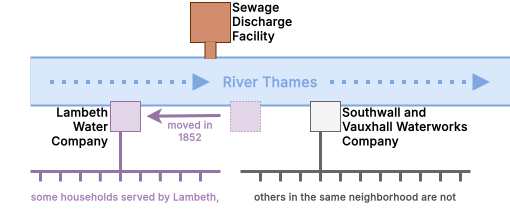
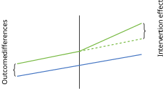
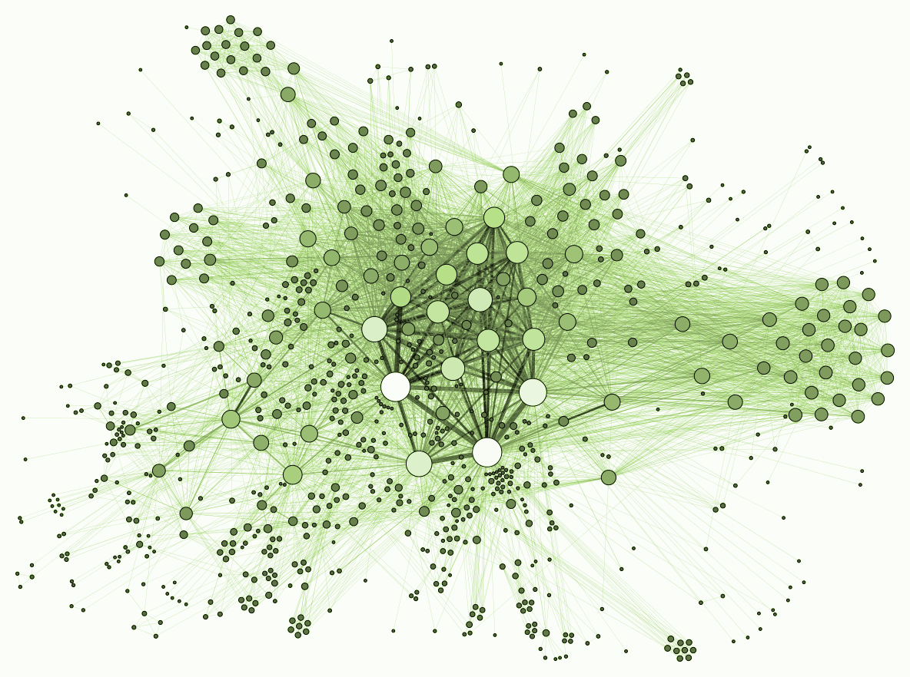
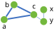
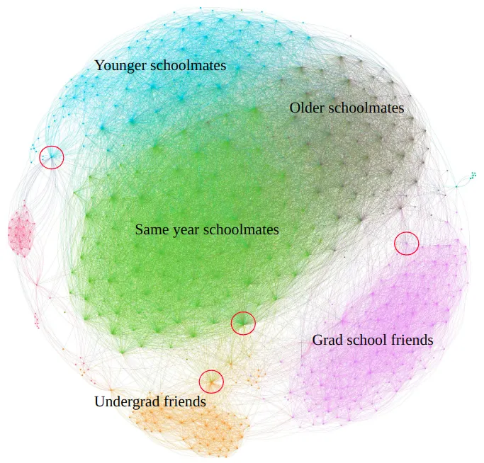




```{r}
#| label: setup
#| include: false
library(plotly)
font_family <- "Inter" 
```

# Causality

## Causality
* Causality is when one [**cause**]{.col1} leads to some [**effect**]{.col2}. 
* The [**cause**]{.col1} is partly responsible for the [**effect**]{.col2}, and the [**effect**]{.col2} partly depends on the [**cause**]{.col1}.
* A **causal** relationship tells us what would happen in alternative (**counterfactual**) worlds. 
* Consider a binary treatment X, and outcome Y. We can think of the **causal effect** $\tau$ as the difference in **potential outcomes**: 
$$
\tau = Y(X=1) - Y(X=0)
$$
* In reality, only [**one outcome**]{.col1} is realized, the other is [**counterfactual**]{.col2}. Thus, we have to estimate this missing outcome to learn about the causal effect. 
* [**Average Treatment Effect:**]{.col1} the average causal effect is simply the mean of all treatment effects
$$
  \tau_{ATE} = \mathrm{E}[\tau_i] = \mathrm{E}[Y(1)-Y(0)]=  \mathrm{E}[Y(1)]- \mathrm{E}[Y(0)]
$$

## Identification
* We say an effect is **causally identified** if we can interpret it causally in our framework and scope. 
* If we want to understand the causal impact of studying on income, $\boldsymbol{y}^{inc} = \boldsymbol{x}^{stu} \beta + \boldsymbol{u}$:
  Studying → Income 
* We likely run into an issue, as you don't get paid for studying but for your skills: 
  Studying → Skills → Income
* Moreover, ability may confound your effect estimates of studying on income, $\boldsymbol{y}^{inc} = \boldsymbol{x}^{stu} \beta + \boldsymbol{u}$, affecting studying, skills, and income. 
* You cannot identify the causal effect of studying on income. 

## Ways of Viewing Causal Questions


The [**Potential Outcomes (PO)**]{.col1} framework is **one way** to view causal questions.

- There is a **treatment** $X_i$ that takes on different values for each unit.
- For each possible level of treatment, there is a certain **potential outcome** $Y(x)$. 
- Only **one** potential outcome is **observed**, the others are **counterfactuals**.


The [**potential outcomes**]{.col1} framework relates very clearly to the notion of a **randomized experiment**. 


A **different framework** that has its strengths **elsewhere**: the [**Directed Acyclic Graphs (DAG)**]{.col2} framework.


- It is a **graphical framework** that helps us identify a causal effect in a network of variables.
- It has its **strengths** in a world with a **large number of (observed) variables**, and
- may help people who prefer thinking **graphically** to understand **causal questions**.


## DAGs for Causal Modeling

<!--
\documentclass[tikz]{standalone}
\begin{document}
\begin{tikzpicture}
  \node[circle, draw, align=center] (A) at (0,0) {studying\\econometrics};
  \node[circle, draw, align=center] (B) at (4,0) {being\\really smart};
  \node[circle, draw, align=center] (C) at (8,0) {others think\\you are cool};
  \draw[->, thick] (A) -- (B);
  \draw[->, thick] (B) -- (C);
\end{tikzpicture}
\end{document}
-->

Why do we talk about [**DAGs**]{.col2} in an **Econometrics** class? [Because they are really useful for **causal modeling**.]{.fragment}

In the following [**DAG**]{.col2}, **nodes** represent **(random) variables**, and **edges** represent (hypothesized) **causal effects**. 

:::{.centering}
:::{.r-stack}
{.fragment .fade-in-then-out width="70%"}

{.fragment width="70%"}
:::
:::

**Missing edges** also convey information: the assumption of **no causal effect**.

## Validity
* In order to assess the quality of causal inferences, it helps to think of the validity of a
statistical analysis. Different concepts of validity include the following:
* [**External validity**]{.col2}: is the validity of an analysis [**outside its own context**]{.col2}, telling us whether [**findings can be generalized**]{.col2} across situations, people, time, regions etc.
* [**Internal validity**]{.col1}: Internal validity is the validity of an analysis within its own context. It is the extent to which the analysis allows for [**causal inference**]{.col1}.
* Empirical evidence may support various different interpretations.
* We want to be able to credibly eliminate non‐causal interpretations.
* [**The Principle of Parsimony**]{.col1} (Occam's razor): There may be incomprehensibly many alternatives for each explanation. The idea is to give preference to the simplest explanation (that cannot be refuted), i.e., the one with the fewest parameters and/or assumptions. 

## Exogeneity
* The exogeneity assumption $\mathbb{E}[\boldsymbol{u} \mid X] = 0$ is sometimes substituted with [**weak exogeneity**]{.col1} $\mathrm{Cov}(X,\boldsymbol{u}) = 0$
* This guarantees consistency, but not unbiasedness of the estimator. 
* A failure of exogeneity is called [**endogeneity**]{.col1}
* It causes bias and inconsistency by confounding the effects of our regressors [**X**]{.col2} and the true errors [**u**]{.col2} on [**y**]{.col2}

## Omitted Variable Bias
* A [**confounder**]{.col1} is an additional variable that drives both the cause and effect
* If we don't account for that variable we can't provide a causal effect explanation for what we observe.
* Bias from a confounder is also called [**omitted variable bias**]{.col1}. It occurs when:
  * The omitted variable is correlated with the regressors ( $\mathrm{Cov}(x_1,x_2) \neq 0$)
  * It is also a determinant of y ($\beta_2 \neq 0$)
* Many (potentially) [**omitted variables**]{.col2} cannot be observed. 
* To solve this we might be able to use [**proxy variables**]{.col1}
* To use a [**proxy variable**]{.col1} to identify a causal effect, it must: 
  1. Correlate with the [**omitted variable**]{.col2}: $\theta_1  \neq 0$
  2. Not correlate with other [**explanatory variables**]{.col2} $Cov(\boldsymbol{X}, \boldsymbol{e}) = 0$
  3. have no direct impact on the [**dependent variable**]{.col2} $Cov(\boldsymbol{z}, \boldsymbol{u}) = 0$

## Type of Selection Bias
* If the sample is not [**random**]{.col2}, we may speak of [**selection bias**]{.col1}
* It is the idea that some subjects are more or less likely to be selected for our sample than others, distorting statistical insight
* Selection bias is related to sample issues that may plague [**external validity**]{.col2}, but also threatens in-sample inference. 
* There are many [**types of selection bias**]{.col1}
* Consider a true $f$ describing a population of size $N$, but we only observe $M (<N)$. Can we learn something using our subset?
* If our $M$ represents a [**random subset of the population**]{.col1}, then the selection process is [**ignorable**]{.col1}
* Otherwise there may be [**selection bias**]{.col1}
* [**endogenous**]{.col2} sample selection, related to the dependent variable
* [**exogenous**]{.col2} sample selection, related to the explanatory or third variables

## Data Issues
* Data may be subject to [**various issues**]{.col1}, due to errors in collection, which may affect our ability to analyse it.
* If there seems to be a pattern to missingness we may have to account for it to [**avoid bias**]{.col1} or to benefit from accounting for it. ([**Truncation**]{.col1}, [**Censoring**]{.col1})
* [**Outliers**]{.col1} are observations that are very different from the rest
* Note: estimation for limited dependent variables done via ML estimators

## Simultaneity and Reverse Causality

The causal effect of interest, i.e., $X \rightarrow Y$, is not always as straightforward as we would like. Instead, we may encounter: 

* [**Reverse Causality**]{.col1}: The issue is determining the direction of causation where $Y \rightarrow X$
  1. Happiness and income: being happy increases productivity → income
  2. Health and exercise: poor health reduces ability to exercise → low exercise correlates with poor health
  3. Education and growth: richer countries invest more in education

* [**Simultaneity**]{.col1}: We need to disentangle the effects where $Y \leftrightarrow X$
  1. Wage and Employment
  2. Price and quantity: market clears instantly – price and quantity determined together.

## Techniques for Causal Identification
*  OLS estimates are [**biased**]{.col1} when regressors are correlated with the error term (omitted variables, simultaneity, reverse causality, measurement errors)
* Several strategies allow us to [**identify causal effects**]{.col2} despite these challenges:
* [**Difference-in-Differences (DiD)**]{.col2}: compare changes over time between a [**treatment and control group**]{.col2}
  * Requires: [**parallel trends assumption**]{.col1} – groups would have evolved similarly absent treatment
* [**Instrumental Variables (IV)**]{.col2}: Use an instrument $Z$ that affects $X$ but has [**no direct effect on $Y$**]{.col1}
  * Requires: relevance ($Z$ correlated with $X$) and [**exclusion restriction**]{.col1} ($Z$ uncorrelated with $u$)

## Techniques for Causal Identification (2)
* [**Regression Discontinuity Design (RDD)**]{.col2}: exploit a [**cutoff rule**]{.col2} that determines treatment assignment
  * Requires: no other discontinuity at the cutoff ([**continuity assumption**]{.col1})
* [**Randomized Controlled Trials (RCT)**]{.col2}: [**random assignment**]{.col2} of treatment ensures independence from all confounders
  * The "gold standard" – but often infeasible for ethical or practical reasons
  
## The Instrumental Variables (IV) Estimator
* **Core problem**: $X_{it}$ is [**endogenous**]{.col1} – correlated with $u_{it}$ – so OLS is biased
* **Idea**: find an instrument $Z$ that isolates [**exogenous variation**]{.col2} in $X$ – variation that is "as good as random"
* An instrument $Z$ must satisfy two conditions:
  * [**Relevance**]{.col2}: $Z$ is correlated with $X$ – $\text{Cov}(Z, X) \neq 0$ – testable with an $F$-test (rule of thumb: $F > 10$)
  * [**Exclusion restriction**]{.col1}: $Z$ affects $Y$ *only through* $X$ – $\text{Cov}(Z, u) = 0$ – [**not directly testable**]{.col1}
  
## The Instrumental Variables (IV) Estimator (2)
* **Two-Stage Least Squares (2SLS)**:
  * **Stage 1**: regress $X$ on $Z$ → obtain $\hat{X}$ (the exogenous part of $X$)
$$X_i = \pi_0 + \pi_1 Z_i + \nu_i$$
  * **Stage 2**: regress $Y$ on $\hat{X}$ → recovers the [**causal effect**]{.col2} of $X$ on $Y$
$$Y_i = \beta_0 + \beta_1 \hat{X}_i + u_i$$
* **Intuition**: IV "throws away" the [**endogenous variation**]{.col1} in $X$ and uses only the [**exogenous variation**]{.col2} induced by $Z$
* **Classic example**: returns to education – instrument $Z$ = quarter of birth (Angrist & Krueger, 1991)
  * Quarter of birth affects schooling (compulsory schooling laws) but has no direct effect on wages
  


# Panel Data

## Panel Data
*  [**Panel data**]{.col2} (longitudinal data) refers to data for $N$ different entities observed at $T$ different time periods
* A [**balanced panel**]{.col2} has all its observations; that is, the variables are observed for each entity and each time period
* An [**unbalanced panel**]{.col2} has some missing data for at least one time period for at least one entity
* Panel data is used as a method for controlling for some types of [**omitted variables**]{.col1} without actually observing them
* By studying changes in the dependent variable over time, it is possible to eliminate the effect of omitted variables that differ across entities but are [**constant over time**]{.col1}
* Panel data allows for analysis of [**dynamics**]{.col2} and improves causal inference compared to pure cross-sections

## Example
* Individuals tracked over time (e.g. income, employment, education)
* Households surveyed repeatedly (e.g. consumption, demographics)
* Firms observed across years (e.g. profits, productivity, employment)
* Countries over time (e.g. GDP, inequality, policy changes)
* Students followed across grades (e.g. test scores, outcomes)
* Workers within firms over time (matched employer–employee data)
* Regions or cities tracked over time (e.g. crime rates, housing prices)
* Political units (e.g. voting behavior across elections)
* Hospitals or patients tracked over time (health outcomes)

## Notation
* Panel data consist of observations on the same $N$ entities over $T$ time periods  
* If the data set includes variables $X$ and $Y$, the data can be written as:
$$
(X_{it}, Y_{it}), \quad i = 1, \dots, N, \quad t = 1, \dots, T
$$
* $i$ indexes the entity (individual, firm, country, etc.)  being observed
* $t$ indexes time (year, month, etc.) of the observation

## Example: Traffic Deaths and Alcohol Taxes
* There are approximately 40,000 highway traffic fatalities each year in the United States. Approximately one-fourth of fatal crashes involve a driver who was drinking, and this fraction rises during peak drinking periods.
*  We study how [**effective various government policies**]{.col2} designed to discourage drunk driving actually are in reducing traffic deaths.
*  [**Panel data set**]{.col1}: the number of traffic fatalities in each state in each year (1982-1988), the type of drunk driving laws in each state in each year, and the tax on beer in each state
* Fatality rate, which is the number of annual traffic deaths per 10,000 people
* We can start by doing the regression for every year: 
$$
\text{Fatality\ Rate}_i = \beta_0 + \beta_1 \text{Beer\ Tax}_i + u_i
$$

## Example: Traffic Deaths and Alcohol Taxes (2)
* 1982 data:
$$
\text{Fatality\ Rate}_i = 2.01 + 0.15 \text{Beer\ Tax}_i
$$
* 1988 data:
$$
\text{Fatality\ Rate}_i = 1.86 + 0.44 \text{Beer\ Tax}_i
$$
* Should we conclude that an increase in the tax on beer leads to more traffic deaths? Not necessarily, because these regressions could have substantial [**omitted variable bias**]{.col2}
*  One approach would be to collect data on all these variables and add them to the annual cross-sectional regressions
* Unfortunately, some of these variables might be very hard or even impossible to measure


# Before and After Comparisons

## Panel Data with 2 Time Periods
* When data for each state are obtained for $T = 2$ time periods, we can [**compare**]{.col2} values of the dependent variable in the [**second period to values in the first period**]{.col2}
* By focusing on changes in the dependent variable, this “before and after” comparison [**holds constant the unobserved factors**]{.col1} that differ from one state to the next but do not change over time within the state
* For example: the local cultural attitude toward drinking and driving
* Let $Z_i$ be a variable that determines the fatality rate in the $i^{th}$ state but does not change over time (so the $t$ subscript is omitted)
* The population linear regression relating $Z_i$ and the real beer tax to the fatality rate:
$$
\text{Fatality\ Rate}_{it} = \beta_0 + \beta_1 \text{Beer\ Tax}_{it} + Z_i + u_{it}
$$

## Before and After Comparison
* Because $Z_i$ does not change over time, in the regression model it will not produce any change in the fatality rate between 1982 and 1988
$$
\text{Fatality\ Rate}_{i1982} = \beta_0 + \beta_1 \text{Beer\ Tax}_{i1982} + Z_i + u_{i1982}
$$
$$
\text{Fatality\ Rate}_{i1988} = \beta_0 + \beta_1 \text{Beer\ Tax}_{i1988} + Z_i + u_{i1988}
$$
*  The influence of $Z_i$ can be eliminated by analyzing the [**change in the fatality rate**]{.col2} between the two periods.
$$
\begin{align}
\text{Fatality\ Rate}_{i,1982} - &\text{Fatality\ Rate}_{i,1988} \\
&= (\beta_0-\beta_0) + \beta_1 (\text{Beer\ Tax}_{i,1982} - \text{Beer\ Tax}_{i,1988}) \nonumber\\
&\quad + (Z_i - Z_i) + (u_{i,1982} - u_{i,1988})
\end{align}
$$

## Example
* This specification has an intuitive interpretation. 
* Cultural attitudes toward drinking and driving affect the level of drunk driving and thus the traffic fatality rate in a state. 
* If they did not change between 1982 and 1988, then they did not produce any change in fatalities in the state.
$$
\begin{align}
\text{Fatality\ Rate}_{i,1982} - &\text{Fatality\ Rate}_{i,1988} \\
&= -0.072 - 1.04 (\text{Beer\ Tax}_{i,1982} - \text{Beer\ Tax}_{i,1988}) \nonumber
\end{align}
$$
* By examining changes in the fatality rate over time, the regression [**controls for fixed factors**]{.col1} such as cultural attitudes toward drinking and driving. 
* The “before and after” method does not apply directly when $T > 2$. 

# Fixed Effects

## Fixed Effects Regression
* To analyze all the observations in our panel data set, we use the method of [**fixed effects regression**]{.col2}
* Fixed effects regression is a method for [**controlling for omitted variables**]{.col2} in panel data when the omitted variables [**vary either only across time or observations**]{.col2}
* For instance, a variable could vary across entities (states) but does not change over time
* The fixed effects regression model has [**$N$ different intercepts**]{.col2}, one for each entity.
* These intercepts can be represented by a set of [**binary (or indicator) variables**]{.col2}
* These binary variables absorb the influences of all omitted variables that differ from one entity to the next but are constant over time

## The Fixed Effects Regression Model

* Consider the regression model with [**FatalityRate**]{.col1} and [**BeerTax**]{.col1} denoted as $Y_{it}$ and $X_{it}$, respectively: 
$$
Y_{it} = \beta_0 + \beta_1 X_{it} + \beta_2 Z_i + u_{it}
$$
* $Z_i$ is an [**unobserved variable**]{.col2} that varies from one state to the next but [**does not change over time**]{.col2} (e.g., cultural attitudes toward drinking and driving)
* We want to estimate $\beta_1$, the effect on $Y$ of $X$, [**holding constant**]{.col1} the unobserved state characteristics $Z$
* Since $Z_i$ is constant over time, our regression can be interpreted as having $N$ intercepts – one per state: $\alpha_i = \beta_0 + \beta_2 Z_i$
* This gives us the fixed effects model:
$$
Y_{it} = \beta_1 X_{it} + \alpha_i + u_{it}
$$

## Entity Fixed Effects
* In $Y_{it} = \beta_1 X_{it} + \alpha_i + u_{it}$, the terms $\alpha_1, \ldots, \alpha_N$ are treated as [**unknown intercepts**]{.col2} to be estimated – one for each state
* The population regression line for the $i^{th}$ state is $\alpha_i + \beta_1 X_{it}$:
  * The [**slope**]{.col1} $\beta_1$ is the **same for all states**
  * The [**intercept**]{.col2} $\alpha_i$ **varies from one state to the next**
* Because $\alpha_i$ can be thought of as the "effect" of being in entity $i$, the terms $\alpha_1, \ldots, \alpha_N$ are known as [**entity fixed effects**]{.col1}
* The variation in entity fixed effects comes from [**omitted variables**]{.col1} that, like $Z_i$, vary across entities but **not over time**

## Fixed Effects via Binary Variables
* The state-specific intercepts in the fixed effects regression model can be expressed using [**binary variables**]{.col1} to denote the individual states.
* Define binary variables $D1_i, D2_i, \ldots, DN_i$ where $Dj_i = 1$ when $i = j$ and $0$ otherwise
* We [**cannot include all $N$ binary variables**]{.col1} plus a common intercept – this causes [**perfect multicollinearity**]{.col1} (the dummy variable trap)
* Solution: [**omit $D1_i$**]{.col2} for the first entity, giving the equivalent model:
$$
Y_{it} = \beta_0 + \beta_1 X_{it} + \gamma_2 D2_i + \gamma_3 D3_i + \cdots + \gamma_N DN_i + u_{it}
$$
* The link between the two representations:
  * **First state**: regression line is $\beta_0 + \beta_1 X_{it}$, so $\alpha_1 = \beta_0$
  * **All other states** ($i \geq 2$): regression line is $\beta_0 + \beta_1 X_{it} + \gamma_i$, so $\alpha_i = \beta_0 + \gamma_i$
* Thus there are [**two equivalent ways**]{.col2} to write the fixed effects regression model

## The Fixed Effects Regression Model: General Form
* The fixed effects regression model with $k$ regressors is:
$$
Y_{it} = \beta_1 X_{1,it} + \cdots + \beta_k X_{k,it} + \alpha_i + u_{it}
$$
* Where $i = 1, \ldots, N$; $t = 1, \ldots, T$; and $\alpha_1, \ldots, \alpha_N$ are [**entity-specific intercepts**]{.col1}
* Equivalently, using a common intercept and $N-1$ [**binary variables**]{.col2} (omitting the first entity):
$$
Y_{it} = \beta_0 + \beta_1 X_{1,it} + \cdots + \beta_k X_{k,it} + \gamma_2 D2_i + \gamma_3 D3_i + \cdots + \gamma_N DN_i + u_{it}
$$
* Where $D2_i = 1$ if $i = 2$ and $0$ otherwise, and so forth
* These two representations are [**equivalent**]{.col2} – both control for all time-invariant entity characteristics
* If there are other observed determinants of $Y$ that are correlated with $X$ and that change over time, then these should also be included in the regression to avoid omitted variable bias

## Application to Traffic Deaths
* OLS estimate of the fixed effects model using [**all 7 years of data**]{.col2} (336 observations):
$$
\text{Fatality\ Rate} = -0.66 \text{Beer\ Tax} + \text{state fixed effects}
$$
* The estimated fixed intercepts are not reported – they are [**not of primary interest**]{.col1}
* The coefficient on Beer Tax is negative: higher beer taxes $\Rightarrow$ fewer traffic deaths
* This is the [**opposite**]{.col2} of the initial cross-sectional results – entity fixed effects remove omitted variable bias
* Difference from the "before and after" regression: uses only **1982 and 1988** data, now we use **all 7 years** → smaller standard error

## Regression with Time Fixed Effects
* [**Entity fixed effects**]{.col1} control for variables [**constant over time**]{.col1} but varying across entities
* [**Time fixed effects**]{.col2} control for variables [**constant across entities**]{.col2} but evolving over time
* Example: automobile safety improvements are introduced nationally → same value for all states but changes over time
* We can extend the model to make the effect of safety $S_t$ explicit:
$$
Y_{it} = \beta_0 + \beta_1 X_{it} + \beta_2 Z_i + \beta_3 S_t + u_{it}
$$
* $S_t$ has only a $t$ subscript → [**changes over time**]{.col2} but is [**constant across states**]{.col1}
* If $S_t$ is correlated with $X_{it}$ and omitted from the regression → [**omitted variable bias**]{.col1}

## Time Fixed Effects Regression Model
* Although $S_t$ is unobserved, its influence can be [**eliminated**]{.col2} – just as $Z_i$ was eliminated by entity fixed effects
* Parallel logic:
  * $Z_i$ varies across states but not over time → [**entity fixed effects**]{.col1}: each state gets its own intercept
  * $S_t$ varies over time but not across states → [**time fixed effects**]{.col2}: each time period gets its own intercept
  
## Time Fixed Effects Regression Model (2)  
* The time fixed effects regression model with a single $X$ regressor:
$$
Y_{it} = \beta_1 X_{it} + \lambda_t + u_{it}
$$
* $\lambda_t$ is a [**different intercept for each time period**]{.col2}
* $\lambda_t$ captures the "effect" of year $t$ on $Y$, so $\lambda_1, \ldots, \lambda_T$ are the [**time fixed effects**]{.col2}
* The variation in time fixed effects comes from [**omitted variables**]{.col1} that vary over time but are constant across entities
* Just as the entity fixed effects regression model, it can be represented using $T - 1$ binary indicators
* In the traffic fatalities regression, the time fixed effects specification allows us to eliminate bias arising from omitted variables that change over time but are the same across states in a given year

# Two-Way Fixed Effects

## Both Entity and Time Fixed Effects
* Some omitted variables are [**constant over time but vary across states**]{.col1} (e.g., cultural norms)
* Others are [**constant across states but vary over time**]{.col2} (e.g., national safety standards)
* When both types are present → include [**both entity and time fixed effects**]{.col1}
* The combined model:
$$
Y_{it} = \beta_1 X_{it} + \alpha_i + \lambda_t + u_{it}
$$
* Where $\alpha_i$ is the [**entity fixed effect**]{.col1} and $\lambda_t$ is the [**time fixed effect**]{.col2}
* Equivalently, using $N-1$ entity binary indicators and $T-1$ time binary indicators:
$$
Y_{it} = \beta_0 + \beta_1 X_{it} + \gamma_2 D2_i + \cdots + \gamma_N DN_i + \delta_2 B2_t + \cdots + \delta_T BT_t + u_{it}
$$
* Where $\beta_0, \beta_1, \gamma_2, \ldots, \gamma_N$ and $\delta_2, \ldots, \delta_T$ are unknown coefficients to be estimated
* We call this the **Two-Way Fixed Effects Estimator**

## Caveats of the Fixed Effects Estimator
* [**Caveat 1**]{.col1}: Fixed effects cannot solve reverse causality. If you have simultaneity or reverse causality bias then you would not use panel fixed effects, specifically when it is really strong, as your identification strategy. 
* [**Caveat 2**]{.col1}: Fixed effects cannot address time-variant unobserved heterogeneity. 
* Using the TWFE is helpful but will not solve your endogeneity issues. 
* Nothing substitutes for careful reasoning and economic theory, as they are necessary conditions for good research design 

## Application to Traffic Deaths: Time Effects Added
* Adding time effects to the state fixed effects model gives:
$$
\text{Fatality Rate} = -0.64 \text{Beer Tax} + \text{State Fixed Effects} + \text{Time Fixed Effects}
$$
* This specification includes [**55 right-hand side variables**]{.col1} in total:
  * 1 beer tax regressor
  * 47 state binary variables ([**state fixed effects**]{.col1})
  * 6 single-year binary variables ([**time fixed effects**]{.col2})
  * 1 intercept
* State/time binary coefficients and intercept are [**not reported**]{.col1} – not of primary interest
* Including time effects has [**little impact**]{.col2} on the coefficient on the real beer tax

# Assumptions and Inference for FE Regression

## The Fixed Effects Regression Assumptions
* The fixed effects model: $Y_{it} = \beta_1 X_{it} + \alpha_i + u_{it}$, $i = 1, \ldots, N$, $t = 1, \ldots, T$, where $\beta_1$ is the [**causal effect**]{.col2} on $Y$ of $X$
* **Assumption 1**: $u_{it}$ has [**conditional mean zero**]{.col1}:
$$E(u_{it} | X_{i1}, X_{i2}, \ldots, X_{iT}, \alpha_i) = 0$$
* **Assumption 2**: $(X_{i1}, X_{i2}, \ldots, X_{iT}, u_{i1}, u_{i2}, \ldots, u_{iT})$, $i = 1, \ldots, N$, are [**i.i.d.**]{.col2} draws from their joint distribution
* **Assumption 3**: [**Large outliers are unlikely**]{.col1}: $(X_{it}, u_{it})$ have nonzero finite fourth moments
* **Assumption 4**: [**No perfect multicollinearity**]{.col1}
* For multiple regressors, $X_{it}$ is replaced by the full list $X_{1,it}, X_{2,it}, \ldots, X_{k,it}$

## Fixed Effects Assumptions: Closer Look
* **Assumption 1** – conditional mean zero given all $T$ values of $X$:
  * Implies [**no omitted variable bias**]{.col1}
  * $u_{it}$ must not depend on *any* values of $X$ for that entity – past, present, or future
  * [**Violated**]{.col1} if current $u_{it}$ is correlated with past, present, or future values of $X$
* **Assumption 2** – variables are [**i.i.d. across entities**]{.col2} for $i = 1, \ldots, N$:
  * Variables for one entity are distributed identically to, but [**independently of**]{.col2}, variables for another entity
  * Holds if entities are selected by [**simple random sampling**]{.col2} from the population
  * Key difference from cross-sectional assumption 2: [**no restriction within an entity**]{.col1} – $X_{it}$ can be correlated over time within the same entity
* Under all four assumptions, the fixed effects estimator is [**consistent**]{.col2} and [**normally distributed**]{.col2} when $N$ is large

## Autocorrelation in Panel Data
* If $X_{it}$ is correlated with $X_{is}$ for $s \neq t$, then $X_{it}$ is [**autocorrelated**]{.col1} (or [**serially correlated**]{.col1})
* Autocorrelation is a [**pervasive feature of time series data**]{.col2}: what happens one year tends to be correlated with what happens the next
* Example: beer tax $X_{it}$ is autocorrelated – legislatures rarely change tax rates year to year, so a high tax in year $t$ tends to remain high in year $t+1$
* $u_{it}$ can also be autocorrelated due to [**persistent omitted factors**]{.col1}, for example:
  * A local economic downturn reduces commuting → fewer fatalities for **multiple years**
  * A road improvement project reduces accidents not just at completion but in **future years**
* Not all omitted factors cause autocorrelation – e.g., severe winter weather that is [**independently distributed**]{.col2} year to year would be serially uncorrelated
* In general, as long as [**some omitted factors are autocorrelated**]{.col1}, $u_{it}$ will be autocorrelated

## Standard Errors for Fixed Effects Regression
* If errors are autocorrelated, the usual [**heteroskedasticity-robust standard errors**]{.col1} are [**not valid**]{.col1} – they assume no serial correlation
* Solution: use [**heteroskedasticity- and autocorrelation-robust (HAR) standard errors**]{.col2}
* The standard approach in panel data: [**clustered standard errors**]{.col2}
  * Allow [**arbitrary correlation within a cluster**]{.col2} (= entity)
  * Assume errors are [**uncorrelated across clusters**]{.col1} (= across entities)
  * Allow for both heteroskedasticity and autocorrelation within an entity
* Clustered standard errors are valid [**whether or not**]{.col2} there is heteroskedasticity, autocorrelation, or both
* When $N$ is large, inference proceeds using:
  * Normal critical values for $t$-statistics
  * $F_{q,\infty}$ critical values for $F$-statistics testing $q$ restrictions

# Data

## Finding Data
* [**High-quality**]{.col2} data is the foundation of credible research
* The choice of data shapes: whether you can answer your research questions, which methodology to use, the validity of results
* [**Data availability**]{.col2} often constrains what we can study, but more data sources exist than we initially suspect
* Different sources offer different [**strengths and limitations**]{.col2}:
* [**Administrative data**]{.col1}: Large scale, high accuracy, often longitudinal, Limited to recorded variables, access can be restricted
* [**Surveys**]{.col1}: Flexible design, can capture attitudes and unobservables, Measurement error, recall bias, smaller samples
* [**Web / scraped data**]{.col1}: Real-time, novel behaviors, large and granular, Selection bias, legal/ethical issues, messy structure
* [**Experimental data**]{.col1}: High causal identification (internal validity), Costly, smaller samples, external validity concerns


## Different Types of Data

::: {.columns}

::: {.column width="50%"}
- Administrative records  
- Household surveys  
- Firm-level / business data  
- Experimental (lab) data  
- Field experimental data (RCTs)  
- Web-scraped data  
- Social media data  
- Transaction data (e.g. credit cards)  
- Sensor / GPS / mobility data  
- Satellite / remote sensing data  
- Text data (documents, news, transcripts)  
- Image / video data  
:::

::: {.column width="50%"}
- Network data (social or economic connections)  
- Platform / marketplace data (e.g. Uber, Airbnb)  
- Qualitative / interview data  
- Audio data (recordings, speech)  
- Biometric data (heart rate, eye tracking)  
- Genetic / DNA data  
- Online search data (e.g. Google Trends)  
- Weather and climate data  
- Administrative legal data (court cases, police reports)  
:::

:::
## Example – Demographic and Health Surveys (DHS)
* Large-scale, nationally representative household surveys in [**developing countries**]{.col1}
* Cover [**topics**]{.col1} such as:
* Fertility, family planning, and maternal health
* Child health and mortality
* HIV/AIDS knowledge and prevalence
* Gender, education, and household characteristics
* Key [**strengths**]{.col1}: High-quality, comparable across countries and time, rich micro-level data (individual & household)
* Key [**limitations**]{.col1}: Self-reported data (measurement error), Cross-sectional (limited panel structure)
* Widely used in [**development and health economics**]{.col1}

## Remotely Sensed Data

:::{.columns}
:::{.column width=0.6}
There is a lot of **remotely sensed data** that is useful for Development Economics:

- Nighttime lights as a proxy for economic activity
- Vegetation indices and rainfall estimates 
- Elevation, terrain ruggedness
- Satellite imagery to detect roads, buildings, mines, conflict areas, \dots ;

\vspace{0.5em}

There are many ways to access this data, among them: **Google Earth Engine**,  **NASA Worldview**, data download
:::
:::{.column width=0.35}
\centering


:::
:::


## Example – Luxembourg Income Study (LIS)
* [**Cross-national microdata**]{.col1} database on income, inequality, and poverty  
* Harmonizes household survey data from multiple countries  
* [**Covers**]{.col1}: Income, earnings, and redistribution, Wealth (via LWS),  Demographics and labor market outcomes  
* Key [**strengths**]{.col1}: High-quality harmonization for inequality research, widely used in top economic research, strong comparability across countries and over time   
* Key [**limitations**]{.col1}: Limited variable detail compared to raw surveys, access requires application and approval, remote execution system (no direct microdata download) 

## Example – Census: IPUMS
* Data [**harmonization**]{.col1} project by IPUMS at the University of Minnesota
* Provides access to: Census and household survey microdata from around the world, U.S. Census and American Community Survey data
* [**Key feature**]{.col1}: Harmonized variables across countries and time, thus enables cross-country and longitudinal comparisons
* Available [**datasets**]{.col1}: IPUMS USA, IPUMS International, IPUMS CPS, IPUMS DHS, etc.
* Key [**strengths**]{.col1}: Large samples, high comparability, easy-to-use extracts
* Key [**limitations**]{.col1}: Some loss of detail due to harmonization, Access restrictions for sensitive data

## Example – WVS & ANES: Public Opinion Data
* Cross-national and U.S.-focused surveys on [**values, attitudes, and political behavior**]{.col1}  
* WVS: Covers 100+ countries over multiple waves, focus on cultural values, beliefs, trust, religion, and social norms  
* ANES: U.S.-focused, election-centered surveys since 1948, covers voting behavior, political attitudes, and public opinion  
* Key [**strengths**]{.col1}: rich information on preferences, beliefs, and norms, long time span (especially ANES), cross-country comparability (WVS)  
* Key [**limitations**]{.col1}: self-reported attitudes (measurement error, social desirability bias), limited causal identification, repeated cross-sections rather than true panels  

## Example – Text
*  Unstructured data from written or spoken language sources  
* [**Common sources**]{.col1}: news articles, policy documents, transcripts, social media posts, forums, reviews, legal texts, reports, historical archives  
* [**Methods**]{.col1}: Keyword search, dictionaries, sentiment analysis, topic modeling, machine learning / NLP  
* Key [**strengths**]{.col1}: Captures beliefs, narratives, and framing, large-scale and often real-time, enables analysis of previously unobservable concepts  
* Key [**limitations**]{.col1}:  Requires substantial preprocessing, measurement depends on method choices, potential bias in text sources (selection, platform effects)  

## Example – Macro data
* Aggregate data describing the economy at the country or regional level  
* [**Common indicators**]{.col1}: GDP, inflation, unemployment, trade, government spending, debt, productivity
* [**Common sources**]{.col1}: World Bank, IMF, OECD, Eurostat, FRED, ECB, ILO, UN data
* Key [**strengths**]{.col1}: Broad coverage across countries and long time periods, Standardized and comparable indicators
* Key [**limitations**]{.col1}: Aggregation masks heterogeneity, Limited ability for causal inference


<!-- Maybe split here between Sannah and Max? For basics I would follow Stock and Watson (and Cunningham), for DiD/ES I would follow Cunningham -->

# Quasi-Experiments

## What is a Quasi-Experiment?

. . .

From your classes in **Econometrics I** and **Econometrics II**, you know what an [**experiment**]{.col2} is and that experiments allow us to use some very convenient methods and estimators. You may also have heard of [**quasi-experiments**]{.col1}, but we are going to revisit them anyway.

:::{.incremental}
- In an [**experiment**]{.col2}, we are able to **randomly assign treatment**. This means that we can divide our sample (randomly) into a treatment group and a control group, and then compare outcomes between them.
- In a [**natural experiment**]{.col1}, we make use of circumstances (either induced by nature, or in some instances by other humans) that exogenously divide subjects into treatment and control groups in a way that makes it seem **as if they were randomly allocated**.
- Other [**quasi-experimental designs**]{.col1} include regression discontinuity designs, event studies, or synthetic control methods.
:::

. . .

We are first going to look at [**natural experiments**]{.col1}.

## Natural Experiments

. . .

::::{.columns}
:::{.column width="60%"}

:vspace1

A [**natural experiment**]{.col1} is a study where an **experimental setting** is **induced by nature** or other factors outside our control.

:::{.incremental}
- It is an **observational study** with properties of randomised experiments.
- This provides a good basis for **causal inference**, and
- does not suffer from **potential issues** of conducting an experiment, such as cost, ethics, feasibility, etc.
- For a natural experiment, we need something to **happen exogenously** and **create variation in treatment**.
:::
:::
:::{.column width="40%" .col0}

:vspace2

{width=100%}

U.S. Representative Alexander Pirnie of New York drawing the first capsule in the Vietnam war draft lottery.

:::
::::


## Cholera

. . .

In the 1800s, London (as well as many other places) was repeatedly hit by waves of a **cholera epidemic**.

:::{.incremental}
- The predominant theory at the time was that the disease was spread by small **inanimate particles** that floated through the air (which is obviously incorrect).
- **John Snow** was a physician working in London at the time, and he suspected instead that cholera was caused by **microscopic living organisms** that entered the body through water and food, multiplied in the body, and then exited the body through urine and feces.
- This would imply that **clean water supply** was a way to slow the spread of the disease.
- Unfortunately, he was only able to collect **anecdotal evidence**, which did not allow him to make a causal claim. 
:::

. . .

Of course, running **an experiment** is infeasible in this context. It would require randomizing households, and allocating clean water to only a subset of them. This was both logistically infeasible and ethically questionable.

## A Natural Experiment

. . .

In 1852, the following happened:

:::{.centering .fragment}
{.noinvert width=80%}
:::

. . .

One water company **moved its pipes** further upstream, to a location that incidentally was upstream of the **main sewage discharge facility**. Suddenly, **households in the same neighborhoods** had access to **different qualities of water**.

## A Natural Experiment

::::{.columns .fragment}
:::{.column width="70%" .incremental}
There were a few other factors that made this situation a **natural experiment**:

- Water companies were not serving disjoint geographical areas. Their networks intersected and often houses in the same street were chaotically served by pipes from different companies.
- John Snow collected extensive additional data and compared characteristics of treatment and control households to confirm their comparability. 
- Most crucially, the change in water supply happened for other reasons and thus induced **exogenous variation**.
:::
:::{.column width="30%" .col0}

:vspace1

{width=100%}
Photograph by @hisgett2015.
:::
::::

. . .

In the end, John Snow collected very convincing evidence for his theory and went on to identify a certain contaminated water pump. The theory, however, was deemed politically unpleasant and was thus not accepted until long after Snow's death.

## Other Examples for Quasi-Experiments

. . .

The following three [**examples**]{.col1} for quasi-experimental research designs are taken from @stock2019:

:::{.incremental}
- To find out whether **immigration** reduces **wages**, we would ideally run an experiment where we randomize the number of immigrants to different municipalities. Of course, this is infeasible. @card1990 used a temporary lifting of restrictions on immigration from Cuba to the U.S., which led to the Mariel boatlift, as a natural experiment. He found no effect of this exogenous influx of immigrants on wages.
- @urquiola2006 analyzed the effect of **class size** on **educational achievement**. This is tricky because students with more favorable socioeconomic backgrounds may tend to enroll in schools with smaller classes. He made use of a particular regulatory discontinuity in Bolivia: There, schools could obtain funding for an additional teacher if there were more than 30 students in a certain grade. The identifying assumption is that grades with just below 30 students should not be systematically different from those with just above 30 students. He found that smaller classes led to much better outcomes.
:::

## The Differences Estimator

. . .

Let us start by looking at probably the simplest estimator for a treatment effect we will ever encounter. The **differences estimator** can be used in [**experimental settings**]{.col1} and can be computed like this:

$$
y_{i} = \beta_0 + D_i\beta_1 + u_i,
$$

where $D_i$ is the treatment indicator.

:vspace1

. . .

If $D$ is truly randomly assigned, then $\mathrm{E}(u_i\mid D_i)=0$, and the **OLS estimator** of the causal effect $\beta_1$ is **unbiased and consistent**.

:vspace1

. . .

We are discussing this estimator not only because we can use it when we run an experiment, but also because what we discuss next is based on it.

## Two Groups Observed Twice {auto-animate="true"}

. . .

In **natural experiment settings**, as long as we have **data on both groups** from both **before the intervention** and **after the intervention**, we can use the [**difference-in-differences**]{.col1} ([**DiD**]{.col1}) estimator. This is a very convenient and simple approach.

:vspace1

. . .

We start by collecting data for the following four subsets of our dataset:

:::{.div}
|                | Before        | After                           |
|----------------|---------------|---------------------------------|
| Control        | $\dots$   | $\dots$               |
| Treatment      | $\dots$ | $\dots$ |
:::

:vspace1

. . .

That is, we compute averages for the treatment group and the control group, both for the before-intervention period and the post-intervention period. Alternatively, we can write this down as follows using three dummies:

$$
y_{i t} = \alpha + \text{after}\: \phi + \text{treated} \: \theta + \text{after}\times\text{treated}\: \delta + u_{it}
$$

## The Difference-in-Differences Estimator {auto-animate="true"}

$$
y_{i t} = \alpha + \text{after}\: \phi + \text{treated} \: \theta + \text{after}\times\text{treated}\: \delta + u_{it}
$$

. . .

We can use the coefficients to express the averages in the table from before:

:::{.div}
|                | Before        | After                           | **Difference** |
|----------------|---------------|---------------------------------|----------------|
| Control        | $\alpha$   | $\alpha + \phi$               | $\phi$       |
| Treatment      | $\alpha + \theta$ | $\alpha + \theta + \phi + \delta$ | $\phi + \delta$ |
| **Difference** | $\theta$    | $\theta + \delta$             | $\delta$     |
:::

. . .

We also added [**differences**]{.col1} to the table. Let us look at the **difference column**. $\phi$ expresses by how much the average in the control group changed from before to after treatment. Analogously, $\phi+\delta$ is the change for the treatment group.

. . .

The **difference between them**, $\delta$, **represents the average treatment effect** (as long as group allocation is as good as random). We can obtain its estimate $\hat{\delta}$ in an extremely easy way just by comparing the averages in this way.


## Diff-in-Diff Illustration

::::{.columns}
:::{.column width=65%}

:vspace3

:::{.centering .fragment}
{width=100%}
:::
:::
:::{.column width="35%"}

:vspace1

[This illustration shows one important **implicit assumption** we make when comparing **differences of differences**.]{.fragment}

:vspace0.5

[The two groups are assumed to follow **parallel trends** before the treatment is applied. Without the treatment, they would have continued in parallel, but the treatment makes the difference between the two lines change.]{.fragment}
:::
::::

<!--
\documentclass{article}
\usepackage{tikz}
\usepackage{tikz-3dplot}
\usetikzlibrary{math}
\usepackage[active,tightpage]{preview}
\PreviewEnvironment{tikzpicture}
\setlength\PreviewBorder{0.125pt}
\usetikzlibrary{decorations.pathreplacing}

\begin{document}
\begin{tikzpicture}[scale=0.8]

% Colors
\definecolor{primary}{HTML}{74B83D}
\definecolor{secondary}{HTML}{4072C2}

% Lines
\draw[black, thick] (0,-0.2) -- (0,4.5);
\draw[secondary, very thick] (-4,0.6) -- (4,2.0);
\draw[primary, very thick] (-4,1.4) -- (0,2.2) -- (4,4.0);
\draw[primary, very thick, dashed] (0,2.2) -- (4,3.0);


% Braces
\draw[decorate, thick, decoration={brace, amplitude=3pt}]
(-4.1,0.6) -- (-4.1,1.4)
node[midway, left=6pt] {};

\draw[decorate, thick, decoration={brace, amplitude=3pt}]
(4.1,4.0) -- (4.1,3.0)
node[midway, right=6pt] {};

% Labels
\node[rotate=90] at (-4.8,2.0) {Outcome differences};
\node[rotate=90] at (5.2,3.6) {Intervention effect};

\end{tikzpicture}

\end{document}
-->


## Estimating a DiD

::::{.columns}
:::{.column width="40%" .fragment .incremental}
Let us **estimate** an average treatment effect using the **DiD estimator**. This is very simple also in terms of implementation.

- `loedata::Fastfood` is a simple example dataset for DiD estimation that contains data on fast food restaurants.
- It contains data on restaurant-level employment (`fte`) for two U.S. states (`nj` and `pa`) before and after a minimum wage increase in New Jersey in 1992.
:::
:::{.column width="60%" .fragment}
```{webr}
library(loedata)
data(Fastfood)

lm(fte ~ nj * after, data = Fastfood)
```
:::
::::


## The DiD Estimator With Additional Regressors

. . . 

Alternatively, we can write the regression equation for the difference-in-differences estimator for a given observation $i$ like this, using first differences:

$$
\Delta y_i = \beta_0 + D_i\beta_1 + u_i,
$$

where $D_i$ is the treatment group indicator and $\Delta y_i$ is the difference in outcomes for individual $i$ between the pre- and the post-treatment period. The **OLS estimator** for $\beta_1$ in this equation is the **DiD estimator**.

:vspace2

. . .

What if we want to include **additional covariates**? Easy:

$$
\Delta y_i = \beta_0 + D_i\beta_1 + \boldsymbol{x}_i'\boldsymbol{\gamma}  + u_i,
$$

with additional variables stored in the vector $\boldsymbol{x}_i$.


## DiD Using Repeated Cross-Sections

. . .

What happens when we **do not have a true panel**, but only **repeated cross-sections**? [**We can still use the DiD estimator.**]{.col1 .fragment}

:::{.incremental}
- If individuals are randomly drawn in both periods, then we can use individuals from the first period as surrogates for the treated and non-treated individuals in the second period.
- Identification does not rely on **following the same individual**, but on **assuming parallel trends** for the two [**groups**]{.col1}.
:::

. . .

Instead of using the convenient first-difference notation, $\Delta y_i = \beta_0 + D_i\beta_1 + u_i$, we have to resort to specifying the model in full, but conceptually nothing changes:

$$
y_{it} = \beta_0 + D_{it}\beta_1 + T_{it}\beta_2+P_{it}\beta_3 + \boldsymbol{x}_i'\boldsymbol{\gamma} + u_{it},
$$

where $D_{it}$ is the treatment indicator as before. It is an interaction of the indicator for being in the (surrogate or actual) treatment group, $T_{it}$; and the indicator for being in the post-treatment time period, $P_{it}$.


## IV Estimation in DiD Settings

. . .

Consider the following case: 

:::{.incremental}
- A **quasi-experiment** yields some variable $Z_i$, and 
- this variable $Z_i$ influences whether $i$ is treated or not. 
- In other words, the difference to before is that it is not the treatment directly that is assigned by the quasi-experiment.
:::

. . .

Then, **if we observe both** $D_i$, the treatment indicator, **and** $Z_i$, [$Z_i$ **is a valid instrument for the treatment** $D_i$]{.col1}.

:vspace1

. . .

This means that we can use the **instrument** to estimate **simple differences**:

$$
y_{i} = \beta_0 + \hat{D}_i\beta_1 + u_i,
$$

where $\hat{D}_i$ is the estimated treatment indicator from the first stage.

## Parallel Trends and Event Studies

. . .

We have mentioned before that the most important assumption in a DiD setting is that of **parallel trends**. Of course, since we cannot observe the counterfactual, we can **never observe whether trends would be parallel** post-treatment. [**What can we do instead?**]{.col1}

:::{.incremental}
- A good first step is to compare pre-treatment trends, e.g. by visualization. But note that three sunny days in a row do not imply sun tomorrow; and neither do parallel past trends imply parallel future trends – at least not without additional assumptions.
- This is a problem that we are never going to be able to solve. But we can try to make a convincing argument for our assumptions.
- One way is to **estimate an event study**. An **event study** can be understood as a DiD where pre- and post-treatment periods are not pooled, but instead a separate DiD coefficient is estimated for each period relative to the pre-treatment baseline:
  $$
  y_{it} = \beta_0 + \sum_{k\neq -1}\beta_{1k}\bigl(T_i\times P^{(k)}_{it}\bigr) + \boldsymbol{x}_i'\boldsymbol{\gamma} + u_{it},\qquad P^{(k)}_{it}=𝟙\{t-t_0=k\}.
  $$
:::

## Event Studies

. . .

The following is an example of an **event study graph** taken from @miller2021.

::::{.columns}
:::{.column width="60%" .fragment}
{width="100%"}
:::
:::{.column width="40%"}
[Their study is about the relationship between an expansion of **Medicare**, a U.S. health program for senior citizens, and **mortality**.]{.fragment}

[Pre-treatment coefficients are close to zero – this can be seen as an **indication of parallel trends**.]{.fragment}

[**After the treatment**, the difference between the differences becomes negative: Enrolled individuals' mortality is lower.]{.fragment}
:::
::::

## Event Study Estimation

::::{.columns}
:::{.column width="40%" .fragment .incremental}
Let us look at the following dataset from the `bacondecomp` package. 

- It contains U.S. state-level data on **homicide rates** and adoption of **stand-your-ground laws** (the “Castle Doctrine”).
- We can use the dataset to estimate an event study, with the adoption of a stand-your-ground law in a certain state being the treatment.
:::
:::{.column width="60%" .fragment}
```{webr}
library(fixest)
library(bacondecomp)

data(castle)
castle$time_to_treat <- ifelse(
  is.na(castle$effyear),
  -1000, 
  castle$year - castle$effyear
  )

es <- feols(l_homicide ~ 
              i(time_to_treat, 
                ref = c(-1, -1000)) | 
              state + year, 
            data = castle)
```
:::
::::

## Event Study Plot

```{webr}
iplot(es, xlab = "Years to treatment", main = "Effect of Castle Doctrine on Log Homicides")
```

## Staggered Treatment

. . .

When we discussed the **DiD** estimator, we have so far assumed that all units are treated at exactly the same time. That may not always be the case, however. When treatment is staggered, we often use the **TWFE estimator**, which we got using this equation:

$$
y_{it} = \mu + \delta D_{it} + \varphi_i+\lambda_t+u_{it}.
$$

:::{.incremental}
- @goodmanbacon2021 shows that the TWFE estimator can be **decomposed into** a weighted average of all potential $2\times 2$ **DiD estimates**. These include comparisons of treated and never-treated units, but also between late and early treated units.
- The comparison between units treated at different times is **problematic when treatment effects vary with time**, because this can introduce **bias**.
- Also, weights depend on cohort sizes and treatment variance (which is largest when groups are treated after exactly half the time).
- @callaway2021 provide an alternative estimation strategy for cohort- and time-specific ATT, which can then be aggregated.
:::

## Regression Discontinuity

::::{.columns}
:::{.column width="62%" .fragment}
```{r}
#| fig-width: 8
#| fig-height: 6.5
#| warning: false
#| message: false
library(plotly)

style_plotly_scale <- function(p, scale = 1.5, family = "Inter, sans-serif") {
  sz <- list(
    base   = 14 * scale,
    title  = 16 * scale,
    tick   = 12 * scale,
    annot  = 16 * scale,
    legend = 12 * scale,
    hover  = 12 * scale
  )
  p |>
    layout(
      font = list(family = family, size = sz$base),
      title = list(font = list(family = family, size = sz$title)),
      xaxis = list(tickfont = list(family = family, size = sz$tick)),
      yaxis = list(tickfont = list(family = family, size = sz$tick)),
      legend = list(font = list(family = family, size = sz$legend)),
      hoverlabel = list(font = list(family = family, size = sz$hover)),
      uniformtext = list(minsize = sz$base, mode = "show")
    )
}

set.seed(42)
N <- 100
x <- rnorm(N)
y <- x * 0.25 + 0.5 * as.integer(x >= 0) + rnorm(N, sd = 0.1)

# Fit models
mdl_all <- lm(y ~ x)
mdl_left <- lm(y[x < 0] ~ x[x < 0])
mdl_right <- lm(y[x >= 0] ~ x[x >= 0])

# Create line data
x_range <- seq(min(x), max(x), length.out = 200)
y_all <- coef(mdl_all)[1] + x_range * coef(mdl_all)[2]

x_left <- x_range[x_range < 0]
y_left <- coef(mdl_left)[1] + x_left * coef(mdl_left)[2]

x_right <- x_range[x_range >= 0]
y_right <- coef(mdl_right)[1] + x_right * coef(mdl_right)[2]

xr <- c(min(x) - 0.2, max(x) + 0.2)
yr <- c(min(y) - 0.1, max(y) + 0.1)

p <- plot_ly() |>
  # Points
  add_markers(x = x, y = y, 
              marker = list(size = 8, symbol = "circle",
                            color = "rgba(120,120,120,0.85)"),
              hoverinfo = "x+y", name = "Data") |>
  # Overall regression (dashed gray)
  add_lines(x = x_range, y = y_all,
            line = list(color = "darkgray", width = 3, dash = "dash"),
            hoverinfo = "name", name = "Overall fit") |>
  # Left segment
  add_lines(x = x_left, y = y_left,
            line = list(color = "#74b83d", width = 5),
            hoverinfo = "name", name = "Below cutoff") |>
  # Right segment
  add_lines(x = x_right, y = y_right,
            line = list(color = "#4072c2", width = 5),
            hoverinfo = "name", name = "Above cutoff") |>
  layout(
    showlegend = FALSE,
    xaxis = list(range = xr, zeroline = FALSE,
                 showgrid = FALSE, title = "Running Variable"),
    yaxis = list(range = yr, zeroline = FALSE,
                 showgrid = FALSE, title = "Outcome",
                 linecolor = "darkgray", linewidth = 1),
    shapes = list(
      # Vertical line at cutoff
      list(type = "line", x0 = 0, x1 = 0, y0 = yr[1], y1 = yr[2],
           line = list(color = "darkgray", width = 1))
    ),
    annotations = list(
      list(x = 0.1, y = 0.2, xref = "x", yref = "y",
           text = "<b>Discontinuity</b>", showarrow = FALSE,
           xanchor = "left",
           font = list(size = 22, family = "Inter, sans-serif", color = "darkgray"))
    ),
    plot_bgcolor = "white", paper_bgcolor = "white"
  ) |>
  style_plotly_scale(scale = 1.6, family = "Inter, sans-serif") |>
  layout(autosize = FALSE, width = 8*96, height = 6.5*96) |>
  config(responsive = FALSE)

p
```
:::
:::{.column width="38%"}

:vspace1

[A [**Regression Discontinuity Design**]{.col1} ([**RDD**]{.col1}) is another type of **quasi-experimental design**.]{.fragment}

:vspace1

[We make use of **a sharp cutoff** in some **running variable** and compare values immediately below and immediately above the cutoff.]{.fragment}

:vspace1

[The **size** of the **discontinuity in outcomes** gives us the [**local treatment effect**]{.col1}.]{.fragment}
:::
::::

## How to Find a Discontinuity Setting?

. . .

One frequently used setting for a regression discontinuity design is something where a certain **test score** is **required** for e.g. being admitted to a university.

:::{.incremental}
- Students that receive **just the required test score**, **or slightly more**, are allowed to, e.g., pursue a degree at the university. This will in turn affect their later job market outcomes, along with a bunch of other things.
- Students whose **score is just below the threshold** should not be systematically dissimilar to those who reached the threshold. But they are denied (in this example case) university education. 
:::

::::{.columns}
:::{.column width="50%" .fragment}
Another frequently used design makes use of **close elections**. Imagine two candidates run for office and the result is close to 50-50. Then, their districts are probably similar and different only in who governs them after the election. 
:::
:::{.column width="50%" .fragment}
:::{.callout-tip title="Think"}
Can you think of more examples where discontinuities arise naturally?
:::
:::
::::

## Sharp and Fuzzy RDD

. . .

There are two ways in which a discontinuity can affect treatment.

:::{.incremental}
- In a [**sharp regression discontinuity design**]{.col1}, whether someone is treated depends precisely, and only, on whether that individual **crosses the threshold**. In the standardized test score example, this would mean that everyone that clears the threshold must attend university, and no one below the threshold attends university, period. In this case, estimation of the treatment effect is simple:
  $$
  y_i = \beta_0 + D_{i}\beta_1 + x_i\beta_2 + u_i,
  $$
  where $D_i$ is the treatment indicator and $x_i$ is the running variable.
- In a [**fuzzy regression discontinuity design**]{.col2}, clearing the threshold **influences treatment**, but is not the only factor. For example, some students that were successful in the exam may still choose not to attend university; and some students below the threshold may get in via a retake. In this case, the treatment indicator is correlated with the error term. But if we observe actual treatment, we can use the threshold-crossing indicator as an **instrument for the actual treatment** and obtain an estimate for $\beta_1$ by IV estimation. 
:::

## Requirements for an RDD

. . .

For an [**ideal RDD**]{.col1}, we need a few things:

:::{.incremental}
- All **other relevant variables** should be continuous at the cutoff, meaning that **they** do not jump.
- There needs to be **randomness** in the assignment around the cutoff. People just below and just above the threshold should be otherwise comparable.
- We also need to model the **functional form** (i.e., of the relationship between the running variable and the outcome) correctly.
:::

. . .

In practice, these requirements are [**hard to check**]{.col2}.

:::{.incremental}
- Effects are often **contaminated** by other factors, as cutoffs often trigger multiple things simultaneously.
- We (obviously) never truly know the **functional form**.
- Treatment assignment can sometimes be **manipulated**. Think of us giving you a half-point you don't deserve in the exam to make you get the better grade.
:::

## Look, I've Found a Discontinuity

::::{.columns}
:::{.column width="62%" .fragment}
```{r}
#| fig-width: 8
#| fig-height: 6.5
#| warning: false
#| message: false
library(plotly)
style_plotly_scale <- function(p, scale = 1.5, family = "Inter, sans-serif") {
  sz <- list(
    base   = 14 * scale,
    title  = 16 * scale,
    tick   = 12 * scale,
    annot  = 16 * scale,
    legend = 12 * scale,
    hover  = 12 * scale
  )
  p |>
    layout(
      font = list(family = family, size = sz$base),
      title = list(font = list(family = family, size = sz$title)),
      xaxis = list(tickfont = list(family = family, size = sz$tick)),
      yaxis = list(tickfont = list(family = family, size = sz$tick)),
      legend = list(font = list(family = family, size = sz$legend)),
      hoverlabel = list(font = list(family = family, size = sz$hover)),
      uniformtext = list(minsize = sz$base, mode = "show")
    )
}
set.seed(727)
N <- 100
x <- 1 + rnorm(N)
y <- 2 + x * 0.25 + rnorm(N)
cutoff <- 1
# Fit models
mdl0 <- lm(y ~ x)
mdl1 <- lm(y[x < cutoff] ~ x[x < cutoff] + I(x[x < cutoff]^2) + I(x[x < cutoff]^3))
mdl2 <- lm(y[x >= cutoff] ~ x[x >= cutoff] + I(x[x >= cutoff]^2) + I(x[x >= cutoff]^3))
# Create fitted values
x_fit <- seq(min(x), max(x), length.out = 500)
y_fit0 <- coef(mdl0)[1] + x_fit * coef(mdl0)[2]
y_fit1 <- coef(mdl1)[1] + x_fit * coef(mdl1)[2] + 
          x_fit^2 * coef(mdl1)[3] + x_fit^3 * coef(mdl1)[4]
y_fit2 <- coef(mdl2)[1] + x_fit * coef(mdl2)[2] + 
          x_fit^2 * coef(mdl2)[3] + x_fit^3 * coef(mdl2)[4]
# Split for plotting
x_left <- x_fit[x_fit < cutoff]
y_left <- y_fit1[x_fit < cutoff]
x_right <- x_fit[x_fit >= cutoff]
y_right <- y_fit2[x_fit >= cutoff]
xr <- c(min(x) - 0.2, max(x) + 0.2)
yr <- c(min(y) - 0.2, max(y) + 0.2)
p <- plot_ly() |>
  # Points
  add_markers(x = x, y = y, 
              marker = list(size = 8, symbol = "circle",
                            color = "rgba(120,120,120,0.85)"),
              hoverinfo = "x+y", name = "Data") |>
  # Overall regression (dashed gray)
  add_lines(x = x_fit, y = y_fit0,
            line = list(color = "darkgray", width = 3, dash = "dash"),
            hoverinfo = "name", name = "Overall fit") |>
  # Left polynomial
  add_lines(x = x_left, y = y_left,
            line = list(color = "#74b83d", width = 5),
            hoverinfo = "name", name = "Below cutoff") |>
  # Right polynomial
  add_lines(x = x_right, y = y_right,
            line = list(color = "#4072c2", width = 5),
            hoverinfo = "name", name = "Above cutoff") |>
  layout(
    showlegend = FALSE,
    xaxis = list(range = xr, zeroline = FALSE,
                 showgrid = FALSE, title = "Running Variable"),
    yaxis = list(range = yr, zeroline = FALSE,
                 showgrid = FALSE, title = "Outcome",
                 linecolor = "darkgray", linewidth = 1),
    shapes = list(
      # Vertical line at cutoff
      list(type = "line", x0 = cutoff, x1 = cutoff, y0 = yr[1], y1 = yr[2],
           line = list(color = "darkgray", width = 1))
    ),
    annotations = list(
      list(x = cutoff + 0.1, y = 3, xref = "x", yref = "y",
           text = "<b>Discontinuity?</b>", showarrow = FALSE,
           xanchor = "left",
           font = list(size = 22, family = "Inter, sans-serif", color = "darkgray"))
    ),
    plot_bgcolor = "white", paper_bgcolor = "white"
  ) |>
  style_plotly_scale(scale = 1.6, family = "Inter, sans-serif") |>
  layout(autosize = FALSE, width = 8*96, height = 6.5*96) |>
  config(responsive = FALSE)
p
```
:::
:::{.column width="38%"}

:vspace2

[A common problem is “fabricating” a discontinuity by **overfitting** the data to both sides of the cutoff.]{.fragment}

:vspace2

[In the example on the left, there is obviously no discontinuity – yet we can fit something that makes one appear.]{.fragment}
:::
::::

## Estimating a Sharp RDD

::::{.columns}
:::{.column width="40%" .fragment .incremental}
To try estimating an RDD, we can use a classic example:

- The `rdrobust_RDsenate` dataset from the `rdrobust` package contains **U.S. Senate election results**.
- There are two variables in the dataset, `margin` is the Democratic candidate's winning margin in $t$, and `vote` is the Democratic vote share in $t+1$.
- We can try to estimate the **incumbency advantage**.
:::
:::{.column width="60%" .bitsmall .fragment}
```{webr}
library(rdrobust)

data(rdrobust_RDsenate)
x <- rdrobust_RDsenate$margin
y <- rdrobust_RDsenate$vote

# Estimate sharp RDD with local linear regression
rd <- rdrobust(y, x, c = 0, p = 1)
```
:::
::::

## Estimating a Sharp RDD

:::{.bitsmall .fragment}
```{webr}
summary(rd)
```
:::

## Plotting a Sharp RDD

:::{.bitsmall .fragment}
```{webr}
#| fig-height: 4
rdplot(y, x, c = 0, p = 1,
       title = "Incumbency Advantage in US Senate Elections",
       x.label = "Margin of Victory (Election t)",
       y.label = "Vote Share (Election t+1)")
```
:::

## Non-Linear Sharp RDD

:::{.bitsmall .fragment}
```{webr}
#| fig-height: 4
rdplot(y, x, c = 0, p = 2,
       title = "Incumbency Advantage in US Senate Elections",
       x.label = "Margin of Victory (Election t)",
       y.label = "Vote Share (Election t+1)")
```
:::


# Networks and Peers

## Networks

::::{.columns}
:::{.column width="63%" .centering .fragment}
{width="100%"}

[Image by @grandjean2013]{.col0}
:::
:::{.column width="37%"}

:vspace1

[Many real-world relationships can be thought of as being organized in [**networks**]{.col1}.]{.fragment}

:::{.incremental}
- Think of every **node** being one of your friends, and the **connections** being whether they know each other.
- Alternatively, think of countries and their trade relationships.
- Or cities and road connections, or ...
:::
:::
::::

## Revisiting Graph Theory Basics {auto-animate="true"}

::::{.columns .fragment}
:::{.column width="70%"}
What you see on the right is what we call a **graph**. Depending on which Econometrics II class you took, you may remember this from the section on DAGs.

This graph has three [**nodes**]{.col1}. They are labeled $i$, $j$, and $k$. [Sometimes, we call the [**nodes**]{.col1} “[vertices]{.col1},” “[agents]{.col1},” “[points]{.col1},” etc.]{.fragment}
:::
:::{.column width="30%"}
{width="100%"}
:::
::::

<!--
\documentclass[tikz]{standalone}
\definecolor{main}{HTML}{74B83D}
\definecolor{secondary}{HTML}{4072C2}

\begin{document}
\begin{tikzpicture}
  \node[circle, fill=main, inner sep=0, minimum size=3.5mm, label=left:{$i$}] (A) at (0, 0) {};
  \node[circle, fill=main, inner sep=0, minimum size=3.5mm, label=right:{$j$}] (B) at (1.5, 0) {};
  \node[circle, fill=main, inner sep=0, minimum size=3.5mm, label=left:{$k$}] (C) at (0.75, 1) {};
  \draw[line width=2pt] (A) edge node[below] {$\{i,j\}$} (B);
  \draw[line width=2pt] (A) edge node[left] {$\{i,k\}$} (C);
\end{tikzpicture}
\end{document}
-->

::::{.columns .fragment}
:::{.column width="70%"}
Some of the [**nodes**]{.col1} in a graph are usually connected to each other, while others are not. We call those connections [**edges**]{.col2}. [Alternatively, they can be called “[links]{.col2},” “[connections]{.col2},” “[lines]{.col2},” etc.]{.fragment}

[[**Edges**]{.col2} are pairs of two [**nodes**]{.col1}. In the second graph, there is one [**edge**]{.col2} from $i$ to $j$. We call this [**edge**]{.col2} $\{i,j\}$.]{.fragment}
:::
:::{.column width="30%"}

:vspace4

{width="100%"}
:::
::::

## Revisiting Graph Theory Basics {auto-animate="true"}

::::{.columns}
:::{.column width="70%"} 
This [**edge**]{.col2} does not have a direction.
:::
:::{.column width="30%"}

<!--
\documentclass[tikz]{standalone}
\definecolor{main}{HTML}{74B83D}
\definecolor{secondary}{HTML}{4072C2}

\begin{document}
\begin{tikzpicture}
  \node[circle, fill=main, inner sep=0, minimum size=3.5mm, label=left:{$i$}] (A) at (0, 0) {};
  \node[circle, fill=main, inner sep=0, minimum size=3.5mm, label=right:{$j$}] (B) at (1.5, 0) {};
  \draw[line width=2pt, color=secondary] (A) edge node[above] {$\{i,j\}$} (B);
\end{tikzpicture}
\end{document}
-->

{width="100%"}
:::
::::

::::{.columns .fragment}
:::{.column width="70%"} 
However, we can easily give [**edges**]{.col2} a direction. We call an [**edge**]{.col2} like this a [**directed edge**]{.col2}. [When an [**edge**]{.col2} is **directed**, the corresponding pair of [**nodes**]{.col1} is no longer an **unordered pair**, but an **ordered pair**: $\{j,i\}\neq\{i,j\}$.]{.fragment} 
:::
:::{.column width="30%"}

<!--
\documentclass[tikz]{standalone}
\definecolor{main}{HTML}{74B83D}
\definecolor{secondary}{HTML}{4072C2}

\begin{document}
\begin{tikzpicture}
  \node[circle, fill=main, inner sep=0, minimum size=3.5mm, label=left:{$i$}] (A) at (0, 0) {};
  \node[circle, fill=main, inner sep=0, minimum size=3.5mm, label=right:{$j$}] (B) at (1.5, 0) {};
  \draw[<-, line width=2pt, color=secondary] (A) edge node[above] {$\{j,i\}$} (B);
\end{tikzpicture}
\end{document}
-->

{width="100%"}
:::
::::

:vspace1

::::{.columns .fragment}
:::{.column width="60%"} 
A **walk** is a sequence of [**edges**]{.col2} that joins a sequence of [**nodes**]{.col1}. A **cycle** is a special case of a **walk** where all [**nodes**]{.col1} are **distinct** and the initial and final [**node**]{.col1} are **equal**. In this graph, $\left\{\{a,b\},\{b,c\},\{c,a\}\right\}$ is a **cycle**.
:::
:::{.column width="40%"}

<!--
\documentclass[tikz]{standalone}
\definecolor{main}{HTML}{74B83D}
\definecolor{secondary}{HTML}{4072C2}

\begin{document}
\begin{tikzpicture}
  \node[circle, fill=main, inner sep=0, minimum size=3.5mm, label=below:{$a$}] (A) at (0, 0) {};
  \node[circle, fill=main, inner sep=0, minimum size=3.5mm, label=left:{$b$}] (B) at (.5, .75) {};
  \node[circle, fill=main, inner sep=0, minimum size=3.5mm, label=above:{$c$}] (C) at (1.5, .25) {};
  \node[circle, fill=main, inner sep=0, minimum size=3.5mm, label=right:{$x$}] (X) at (2, .5) {};
  \node[circle, fill=main, inner sep=0, minimum size=3.5mm, label=right:{$y$}] (Y) at (2, -.1) {};

  \draw[line width=2pt, color=secondary] (A) -- (B);
  \draw[line width=2pt, color=secondary] (B) -- (C);
  \draw[line width=2pt, color=secondary] (C) -- (A);
  \draw[line width=.5pt, color=secondary] (C) -- (Y);
  \draw[line width=.5pt, color=secondary] (Y) -- (X);
\end{tikzpicture}
\end{document}
-->

{width="100%"}
:::
::::

## Social Networks

::::{.columns .fragment}
:::{.column width="50%"}
[For the image on this slide, someone (not me) collected data on their **Instagram followers**, and the connections between them.]{.fragment}

[Coincidentally, this [**social network**]{.col1} is related to a **social media site**, which we colloquially often refer to as “social networks.” But in the context of network analysis, a **social network** is any network that connects people.]{.fragment} 

:::{.callout-tip title="Think" .fragment}
Colors were manually assigned, but positions were not. Why do similar people cluster together?
:::
:::
:::{.column width="50%" .centering}


[Image by @giraffael2024]{.col0}
:::
::::

## Trade Networks

::::{.columns}
:::{.column width="70%" .fragment}
```{r}
#| fig-width: 9
#| fig-height: 6.5
#| warning: false
#| message: false
library(dplyr)
library(igraph)
library(plotly)
library(scales)
library(countrycode)

style_plotly_scale <- function(p, scale = 1.5, family = "Inter, sans-serif") {
  sz <- list(
    base   = 14 * scale,
    title  = 16 * scale,
    tick   = 12 * scale,
    annot  = 16 * scale,
    legend = 12 * scale,
    hover  = 12 * scale
  )
  p |>
    layout(
      font = list(family = family, size = sz$base),
      title = list(font = list(family = family, size = sz$title)),
      xaxis = list(tickfont = list(family = family, size = sz$tick)),
      yaxis = list(tickfont = list(family = family, size = sz$tick)),
      legend = list(font = list(family = family, size = sz$legend)),
      hoverlabel = list(font = list(family = family, size = sz$hover)),
      uniformtext = list(minsize = sz$base, mode = "show")
    )
}

# Load data
raw <- readRDS("trade.RDS")

# Parameters
col_rep <- "reporter_iso"
col_par <- "partner_iso"
col_val <- "primary_value"

# Build edge list
top_edges <- 300
edges <- raw |>
  transmute(
    from  = .data[[col_rep]],
    to    = .data[[col_par]],
    value = as.numeric(.data[[col_val]])
  ) |>
  filter(!is.na(from), !is.na(to), from != to, is.finite(value), value > 0) |>
  filter(from != "S19", to != "S19") |>
  group_by(from, to) |>
  summarise(value = sum(value), .groups = "drop") |>
  arrange(desc(value)) |>
  slice_head(n = top_edges)

# Graph + layout
g <- graph_from_data_frame(edges, directed = TRUE)
set.seed(1)
lay <- layout_with_fr(g)
nodes <- data.frame(
  name = V(g)$name,
  x = lay[,1],
  y = lay[,2],
  stringsAsFactors = FALSE
)

# Node size = total trade
out_val <- edges |> group_by(node = from) |> summarise(out_value = sum(value), .groups = "drop")
in_val  <- edges |> group_by(node = to)   |> summarise(in_value  = sum(value), .groups = "drop")
nodes <- nodes |>
  left_join(out_val, by = c("name" = "node")) |>
  left_join(in_val,  by = c("name" = "node")) |>
  mutate(
    out_value = ifelse(is.na(out_value), 0, out_value),
    in_value  = ifelse(is.na(in_value),  0, in_value),
    total_value = out_value + in_value,
    size = rescale(log1p(total_value), to = c(12, 40))
  )

# Node color = continent + country name
nodes <- nodes |>
  mutate(
    continent = countrycode::countrycode(name, origin = "iso3c", destination = "continent"),
    continent = ifelse(is.na(continent), "Other/Unknown", continent),
    country_name = countrycode::countrycode(name, origin = "iso3c", destination = "country.name"),
    country_name = ifelse(is.na(country_name), name, country_name)
  )

# Add country names to edges for hover
edges <- edges |>
  mutate(
    from_name = countrycode::countrycode(from, origin = "iso3c", destination = "country.name"),
    from_name = ifelse(is.na(from_name), from, from_name),
    to_name = countrycode::countrycode(to, origin = "iso3c", destination = "country.name"),
    to_name = ifelse(is.na(to_name), to, to_name)
  )

# Prepare edge coordinates
edges_plot <- edges |>
  mutate(
    x    = nodes$x[match(from, nodes$name)],
    y    = nodes$y[match(from, nodes$name)],
    xend = nodes$x[match(to,   nodes$name)],
    yend = nodes$y[match(to,   nodes$name)]
  )

# Edge thickness bins
nbins <- 6
edges_plot <- edges_plot |>
  mutate(
    w_bin = cut(
      log1p(value),
      breaks = quantile(log1p(value), probs = seq(0, 1, length.out = nbins + 1), na.rm = TRUE),
      include.lowest = TRUE,
      labels = paste0("bin", seq_len(nbins))
    )
  )
bin_levels <- levels(edges_plot$w_bin)
bin_widths <- setNames(seq(0.5, 4.5, length.out = length(bin_levels)), bin_levels)

# Saturated colors for continents
continent_colors <- c(
  "Africa" = "#74b83d",
  "Americas" = "#4072c2",
  "Asia" = "#ED017D",
  "Europe" = "#d18b2a",
  "Oceania" = "#666666"
)

# Build plot
p <- plot_ly()

for (b in rev(bin_levels)) {
  dfb <- edges_plot |> filter(w_bin == b)
  p <- p |>
    add_segments(
      data = dfb,
      x = ~x, y = ~y, xend = ~xend, yend = ~yend,
      opacity = 0.25,
      line = list(width = unname(bin_widths[b]), color = "gray50"),
      hoverinfo = "text",
      text = ~paste0(from_name, " \u2192 ", to_name, "<br>USD ", scales::comma(value)),
      showlegend = FALSE
    )
}

# Add markers for each continent separately to control size directly
for (cont in names(continent_colors)) {
  df_cont <- nodes |> filter(continent == cont)
  if (nrow(df_cont) > 0) {
    p <- p |>
      add_markers(
        data = df_cont,
        x = ~x, y = ~y,
        hoverinfo = "text",
        text = ~paste0(
          country_name,
          "<br>", continent,
          "<br>Total: USD ", scales::comma(total_value),
          "<br>Out: USD ", scales::comma(out_value),
          "<br>In: USD ", scales::comma(in_value)
        ),
        marker = list(
          size = df_cont$size,
          color = continent_colors[cont],
          opacity = 0.9,
          line = list(width = 1.5, color = "black")
        ),
        name = cont,
        showlegend = TRUE
      )
  }
}

p <- p |>
  layout(
    showlegend = TRUE,
    xaxis = list(visible = FALSE, zeroline = FALSE, showgrid = FALSE),
    yaxis = list(visible = FALSE, zeroline = FALSE, showgrid = FALSE),
    plot_bgcolor = "white",
    paper_bgcolor = "white"
  ) |>
  style_plotly_scale(scale = 1.6, family = "Inter, sans-serif") |>
  layout(autosize = FALSE, width = 9*96, height = 6.5*96) |>
  config(responsive = FALSE)
p
```
:::
:::{.column width="30%"}
:vspace2

[This **network graph** shows **refined copper** trade flows in the year 2023 between a number of countries, colored by continent.]{.fragment}

:vspace1

[We can see that European countries cluster together since they trade a lot among each other.]{.fragment}

:::
::::


## Drawing a Network

::::{.columns}
:::{.column width="40%"}

:vspace1

[We can investigate this a little further. Say we want to [**draw a network graph**]{.col1} of all subway stations in Vienna.]{.fragment}

:::{.incremental}
- Stations are **nodes**, and
- stations that are connected by a subway line get an **edge**.
:::

:vspace1

[We end up with a symmetric **adjacency matrix** that has 99 rows/columns.]{.fragment}


:::
:::{.column width="60%" .fragment}

:vspace3

$$
\boldsymbol{W}=
\left(
\begin{array}{c|ccccc c}
 & \text{AD} & \text{AE} & \text{AK} & \text{AL} & \text{AN} & \\
\hline
\text{AD} & 0 & 0 & 0 & 0 & 0 & \cdots \\
\text{AE} & 0 & 0 & 0 & 0 & 0 & \cdots \\
\text{AK} & 0 & 0 & 0 & 0 & 0 & \cdots \\
\text{AL} & 0 & 0 & 0 & 0 & 0 & \cdots \\
\text{AN} & 0 & 0 & 0 & 0 & 0 & \cdots \\
 & \vdots & \vdots & \vdots & \vdots & \vdots & \ddots
\end{array}
\right)
$$
:::
::::


## Mapping Subway Stations

::::{.columns}
:::{.column width="62%" .fragment}
```{r}
#| fig-width: 8
#| fig-height: 6.5
#| warning: false
#| message: false
library(igraph)
library(plotly)
library(graphlayouts)

style_plotly_scale <- function(p, scale = 1.5, family = "Inter, sans-serif") {
  sz <- list(
    base   = 14 * scale,
    title  = 16 * scale,
    tick   = 12 * scale,
    annot  = 16 * scale,
    legend = 12 * scale,
    hover  = 12 * scale
  )
  p |>
    layout(
      font = list(family = family, size = sz$base),
      title = list(font = list(family = family, size = sz$title)),
      xaxis = list(tickfont = list(family = family, size = sz$tick)),
      yaxis = list(tickfont = list(family = family, size = sz$tick)),
      legend = list(font = list(family = family, size = sz$legend)),
      hoverlabel = list(font = list(family = family, size = sz$hover)),
      uniformtext = list(minsize = sz$base, mode = "show")
    )
}

# Station name lookup
station_names <- c(
  "AD" = "Alte Donau",
  "AE" = "Alterlaa",
  "AK" = "Aderklaaer Straße",
  "AL" = "Alaudagasse",
  "AN" = "Aspern Nord",
  "AP" = "Aspernstraße",
  "AR" = "Hardeggasse",
  "AS" = "Alser Straße",
  "AT" = "Altes Landgut",
  "AU" = "Spittelau",
  "AW" = "Gasometer",
  "AZ" = "Lina-Loos-Platz",
  "BA" = "Museumsquartier",
  "BR" = "Braunschweiggasse",
  "BU" = "Burggasse – Stadthalle",
  "DI" = "Donauinsel",
  "DM" = "Donaumarina",
  "DP" = "Donauspital",
  "DS" = "Dresdner Straße",
  "DT" = "Donaustadtbrücke",
  "ED" = "Erdberg",
  "EE" = "Seestadt",
  "EK" = "Enkplatz",
  "ES" = "Erlaaer Straße",
  "FB" = "Friedensbrücke",
  "FL" = "Floridsdorf",
  "GF" = "Großfeldsiedlung",
  "GU" = "Gumpendorfer Straße",
  "GZ" = "Zieglergasse",
  "HF" = "Hütteldorf",
  "HH" = "Hütteldorfer Straße",
  "HI" = "Hietzing",
  "HK" = "Handelskai",
  "HS" = "Heiligenstadt",
  "HT" = "Siebenhirten",
  "HU" = "Hausfeldstraße",
  "HZ" = "Herrengasse",
  "JG" = "Jägerstraße",
  "JO" = "Johnstraße",
  "JS" = "Josefstädter Straße",
  "KE" = "Keplerplatz",
  "KG" = "Kettenbrückengasse",
  "KM" = "Kaisermühlen – VIC",
  "KN" = "Kardinal-Nagl-Platz",
  "KP" = "Karlsplatz",
  "KR" = "Kendlerstraße",
  "KT" = "Kagraner Platz",
  "LA" = "Landstraße",
  "LE" = "Längenfeldgasse",
  "LN" = "Neulaa",
  "LO" = "Oberlaa",
  "LU" = "Leopoldau",
  "MA" = "Neubaugasse",
  "MB" = "Michelbeuern – AKH",
  "MG" = "Margaretengürtel",
  "MH" = "Meidling Hauptstraße",
  "MS" = "Messe – Prater",
  "ND" = "Neue Donau",
  "NH" = "Niederhofstraße",
  "NP" = "Nestroyplatz",
  "NS" = "Nußdorfer Straße",
  "OK" = "Ottakring",
  "OV" = "Ober St. Veit",
  "PF" = "Perfektastraße",
  "PG" = "Pilgramgasse",
  "PH" = "Bahnhof Meidling",
  "PP" = "Zippererstraße",
  "PR" = "Praterstern",
  "PW" = "Am Schöpfwerk",
  "RB" = "Rennbahnweg",
  "RG" = "Rochusgasse",
  "RH" = "Rathaus",
  "RL" = "Roßauer Lände",
  "RP" = "Reumannplatz",
  "SA" = "Simmering",
  "SB" = "Schönbrunn",
  "SD" = "Stadlau",
  "SE" = "Stubentor",
  "SG" = "Schlachthausgasse",
  "SH" = "Schweglerstraße",
  "SL" = "Südtiroler Platz",
  "SO" = "Schottentor",
  "SP" = "Schwedenplatz",
  "SR" = "Schottenring",
  "ST" = "Stadtpark",
  "SW" = "Stadion",
  "SZ" = "Stephansplatz",
  "TA" = "Taubstummengasse",
  "TB" = "Taborstraße",
  "TE" = "Tscherttegasse",
  "TO" = "Troststraße",
  "TR" = "Krieau",
  "TS" = "Thaliastraße",
  "UV" = "Unter St. Veit",
  "VS" = "Vorgartenstraße",
  "VT" = "Volkstheater",
  "WA" = "Währinger Straße",
  "WS" = "Westbahnhof",
  "ZK" = "Kagran"
)

# Create the adjacency matrix
adj_matrix <- as.matrix(read.csv("adjmatrix.csv", header = FALSE))

# Define node names
node_names <- c("AD", "AE", "AK", "AL", "AN", "AP", "AR", "AS", "AT", "AU", "AW", "AZ", "BA", "BR", "BU", "DI", "DM", "DP", "DS", "DT", "ED", "EE", "EK", "ES", "FB", "FL", "GF", "GU", "GZ", "HF", "HH", "HI", "HK", "HS", "HT", "HU", "HZ", "JG", "JO", "JS", "KE", "KG", "KM", "KN", "KP", "KR", "KT", "LA", "LE", "LN", "LO", "LU", "MA", "MB", "MG", "MH", "MS", "ND", "NH", "NP", "NS", "OK", "OV", "PF", "PG", "PH", "PP", "PR", "PW", "RB", "RG", "RH", "RL", "RP", "SA", "SB", "SD", "SE", "SG", "SH", "SL", "SO", "SP", "SR", "ST", "SW", "SZ", "TA", "TB", "TE", "TO", "TR", "TS", "UV", "VS", "VT", "WA", "WS", "ZK")
dimnames(adj_matrix) <- list(node_names, node_names)

# Create graph
g <- graph_from_adjacency_matrix(adj_matrix, mode = "undirected")

# Layout
set.seed(1)
lay <- layout_with_kk(g)

# Node data
nodes <- data.frame(
  name = V(g)$name,
  x = lay[, 1],
  y = lay[, 2],
  stringsAsFactors = FALSE
)
nodes$full_name <- station_names[nodes$name]

# Edge list from graph
edge_list <- as_edgelist(g)
edges_plot <- data.frame(
  from = edge_list[, 1],
  to = edge_list[, 2],
  stringsAsFactors = FALSE
)

# Add coordinates
edges_plot$x <- nodes$x[match(edges_plot$from, nodes$name)]
edges_plot$y <- nodes$y[match(edges_plot$from, nodes$name)]
edges_plot$xend <- nodes$x[match(edges_plot$to, nodes$name)]
edges_plot$yend <- nodes$y[match(edges_plot$to, nodes$name)]
edges_plot$from_name <- station_names[edges_plot$from]
edges_plot$to_name <- station_names[edges_plot$to]

# Build plot
p <- plot_ly()

# Add edges
p <- p |>
  add_segments(
    data = edges_plot,
    x = ~x, y = ~y, xend = ~xend, yend = ~yend,
    opacity = 1,
    line = list(width = 2, color = "black"),
    hoverinfo = "text",
    text = ~paste0(from_name, " – ", to_name),
    showlegend = FALSE
  )

# Add nodes
p <- p |>
  add_markers(
    data = nodes,
    x = ~x, y = ~y,
    hoverinfo = "text",
    text = ~full_name,
    marker = list(
      size = 25,
      color = "#74b83d",
      opacity = 0.9,
      line = list(width = 1.5, color = "black")
    ),
    showlegend = FALSE
  )

# Add node labels
p <- p |>
  add_text(
    data = nodes,
    x = ~x, y = ~y,
    text = ~name,
    textfont = list(size = 10, color = "black", family = "Inter, sans-serif"),
    hoverinfo = "none",
    showlegend = FALSE
  )

# Layout
p <- p |>
  layout(
    showlegend = FALSE,
    xaxis = list(visible = FALSE, zeroline = FALSE, showgrid = FALSE),
    yaxis = list(visible = FALSE, zeroline = FALSE, showgrid = FALSE),
    plot_bgcolor = "white",
    paper_bgcolor = "white"
  ) |>
  style_plotly_scale(scale = 1.6, family = "Inter, sans-serif") |>
  layout(autosize = FALSE, width = 8 * 96, height = 6.5 * 96) |>
  config(responsive = FALSE)

p
```
:::
:::{.column width="38%"}

:vspace1

[This graph is constructed from the **adjacency matrix** from before, with no geographic information.]{.fragment}

:vspace0.5

[The resulting graph **resembles the actual subway map** closely. Using a standard plotting algorithm, we can recover the [**latent space**]{.col1} encoded in the network.]{.fragment}

:vspace0.5

[**Networks** contain interesting information beyond plain links.]{.fragment}
:::
::::


## Centrality 

::::{.columns}
:::{.column width="62%"}
```{r}
#| fig-width: 8
#| fig-height: 6.5
#| warning: false
#| message: false
library(igraph)
library(plotly)
library(graphlayouts)

style_plotly_scale <- function(p, scale = 1.5, family = "Inter, sans-serif") {
  sz <- list(
    base   = 14 * scale,
    title  = 16 * scale,
    tick   = 12 * scale,
    annot  = 16 * scale,
    legend = 12 * scale,
    hover  = 12 * scale
  )
  p |>
    layout(
      font = list(family = family, size = sz$base),
      title = list(font = list(family = family, size = sz$title)),
      xaxis = list(tickfont = list(family = family, size = sz$tick)),
      yaxis = list(tickfont = list(family = family, size = sz$tick)),
      legend = list(font = list(family = family, size = sz$legend)),
      hoverlabel = list(font = list(family = family, size = sz$hover)),
      uniformtext = list(minsize = sz$base, mode = "show")
    )
}

# Station name lookup
station_names <- c(
  "AD" = "Alte Donau",
  "AE" = "Alterlaa",
  "AK" = "Aderklaaer Straße",
  "AL" = "Alaudagasse",
  "AN" = "Aspern Nord",
  "AP" = "Aspernstraße",
  "AR" = "Hardeggasse",
  "AS" = "Alser Straße",
  "AT" = "Altes Landgut",
  "AU" = "Spittelau",
  "AW" = "Gasometer",
  "AZ" = "Lina-Loos-Platz",
  "BA" = "Museumsquartier",
  "BR" = "Braunschweiggasse",
  "BU" = "Burggasse – Stadthalle",
  "DI" = "Donauinsel",
  "DM" = "Donaumarina",
  "DP" = "Donauspital",
  "DS" = "Dresdner Straße",
  "DT" = "Donaustadtbrücke",
  "ED" = "Erdberg",
  "EE" = "Seestadt",
  "EK" = "Enkplatz",
  "ES" = "Erlaaer Straße",
  "FB" = "Friedensbrücke",
  "FL" = "Floridsdorf",
  "GF" = "Großfeldsiedlung",
  "GU" = "Gumpendorfer Straße",
  "GZ" = "Zieglergasse",
  "HF" = "Hütteldorf",
  "HH" = "Hütteldorfer Straße",
  "HI" = "Hietzing",
  "HK" = "Handelskai",
  "HS" = "Heiligenstadt",
  "HT" = "Siebenhirten",
  "HU" = "Hausfeldstraße",
  "HZ" = "Herrengasse",
  "JG" = "Jägerstraße",
  "JO" = "Johnstraße",
  "JS" = "Josefstädter Straße",
  "KE" = "Keplerplatz",
  "KG" = "Kettenbrückengasse",
  "KM" = "Kaisermühlen – VIC",
  "KN" = "Kardinal-Nagl-Platz",
  "KP" = "Karlsplatz",
  "KR" = "Kendlerstraße",
  "KT" = "Kagraner Platz",
  "LA" = "Landstraße",
  "LE" = "Längenfeldgasse",
  "LN" = "Neulaa",
  "LO" = "Oberlaa",
  "LU" = "Leopoldau",
  "MA" = "Neubaugasse",
  "MB" = "Michelbeuern – AKH",
  "MG" = "Margaretengürtel",
  "MH" = "Meidling Hauptstraße",
  "MS" = "Messe – Prater",
  "ND" = "Neue Donau",
  "NH" = "Niederhofstraße",
  "NP" = "Nestroyplatz",
  "NS" = "Nußdorfer Straße",
  "OK" = "Ottakring",
  "OV" = "Ober St. Veit",
  "PF" = "Perfektastraße",
  "PG" = "Pilgramgasse",
  "PH" = "Bahnhof Meidling",
  "PP" = "Zippererstraße",
  "PR" = "Praterstern",
  "PW" = "Am Schöpfwerk",
  "RB" = "Rennbahnweg",
  "RG" = "Rochusgasse",
  "RH" = "Rathaus",
  "RL" = "Roßauer Lände",
  "RP" = "Reumannplatz",
  "SA" = "Simmering",
  "SB" = "Schönbrunn",
  "SD" = "Stadlau",
  "SE" = "Stubentor",
  "SG" = "Schlachthausgasse",
  "SH" = "Schweglerstraße",
  "SL" = "Südtiroler Platz",
  "SO" = "Schottentor",
  "SP" = "Schwedenplatz",
  "SR" = "Schottenring",
  "ST" = "Stadtpark",
  "SW" = "Stadion",
  "SZ" = "Stephansplatz",
  "TA" = "Taubstummengasse",
  "TB" = "Taborstraße",
  "TE" = "Tscherttegasse",
  "TO" = "Troststraße",
  "TR" = "Krieau",
  "TS" = "Thaliastraße",
  "UV" = "Unter St. Veit",
  "VS" = "Vorgartenstraße",
  "VT" = "Volkstheater",
  "WA" = "Währinger Straße",
  "WS" = "Westbahnhof",
  "ZK" = "Kagran"
)

# Create the adjacency matrix
adj_matrix <- as.matrix(read.csv("adjmatrix.csv", header = FALSE))

# Define node names
node_names <- c("AD", "AE", "AK", "AL", "AN", "AP", "AR", "AS", "AT", "AU", "AW", "AZ", "BA", "BR", "BU", "DI", "DM", "DP", "DS", "DT", "ED", "EE", "EK", "ES", "FB", "FL", "GF", "GU", "GZ", "HF", "HH", "HI", "HK", "HS", "HT", "HU", "HZ", "JG", "JO", "JS", "KE", "KG", "KM", "KN", "KP", "KR", "KT", "LA", "LE", "LN", "LO", "LU", "MA", "MB", "MG", "MH", "MS", "ND", "NH", "NP", "NS", "OK", "OV", "PF", "PG", "PH", "PP", "PR", "PW", "RB", "RG", "RH", "RL", "RP", "SA", "SB", "SD", "SE", "SG", "SH", "SL", "SO", "SP", "SR", "ST", "SW", "SZ", "TA", "TB", "TE", "TO", "TR", "TS", "UV", "VS", "VT", "WA", "WS", "ZK")
dimnames(adj_matrix) <- list(node_names, node_names)

# Create graph
g <- graph_from_adjacency_matrix(adj_matrix, mode = "undirected")

# Layout
set.seed(1)
lay <- layout_with_kk(g)

# Node data
nodes <- data.frame(
  name = V(g)$name,
  x = lay[, 1],
  y = lay[, 2],
  stringsAsFactors = FALSE
)
nodes$full_name <- station_names[nodes$name]

# Edge list from graph
edge_list <- as_edgelist(g)
edges_plot <- data.frame(
  from = edge_list[, 1],
  to = edge_list[, 2],
  stringsAsFactors = FALSE
)

# Add coordinates
edges_plot$x <- nodes$x[match(edges_plot$from, nodes$name)]
edges_plot$y <- nodes$y[match(edges_plot$from, nodes$name)]
edges_plot$xend <- nodes$x[match(edges_plot$to, nodes$name)]
edges_plot$yend <- nodes$y[match(edges_plot$to, nodes$name)]
edges_plot$from_name <- station_names[edges_plot$from]
edges_plot$to_name <- station_names[edges_plot$to]

# Build plot
p <- plot_ly()

# Add edges
p <- p |>
  add_segments(
    data = edges_plot,
    x = ~x, y = ~y, xend = ~xend, yend = ~yend,
    opacity = 1,
    line = list(width = 2, color = "black"),
    hoverinfo = "text",
    text = ~paste0(from_name, " – ", to_name),
    showlegend = FALSE
  )

# Add nodes
p <- p |>
  add_markers(
    data = nodes,
    x = ~x, y = ~y,
    hoverinfo = "text",
    text = ~full_name,
    marker = list(
      size = 25,
      color = "#74b83d",
      opacity = 0.9,
      line = list(width = 1.5, color = "black")
    ),
    showlegend = FALSE
  )

# Add node labels
p <- p |>
  add_text(
    data = nodes,
    x = ~x, y = ~y,
    text = ~name,
    textfont = list(size = 10, color = "black", family = "Inter, sans-serif"),
    hoverinfo = "none",
    showlegend = FALSE
  )

# Layout
p <- p |>
  layout(
    showlegend = FALSE,
    xaxis = list(visible = FALSE, zeroline = FALSE, showgrid = FALSE),
    yaxis = list(visible = FALSE, zeroline = FALSE, showgrid = FALSE),
    plot_bgcolor = "white",
    paper_bgcolor = "white"
  ) |>
  style_plotly_scale(scale = 1.6, family = "Inter, sans-serif") |>
  layout(autosize = FALSE, width = 8 * 96, height = 6.5 * 96) |>
  config(responsive = FALSE)

p
```
:::
:::{.column width="38%"}

[Some stations are depicted in the **center**, and when you are there, you can reach other places easily.]{.fragment}

[This relates to an important concept: the [**centrality**]{.col1} of nodes in a network.]{.fragment}

[The simplest centrality measure is a node's **degree**, the sum of its connections.]{.fragment}

[More elaborate measures include **eigenvector centrality**, a derivative of which is used to rank pages in Google searches.]{.fragment}
:::
::::


## Peers

. . . 

Your immediate connections in a network are your [**peers**]{.col1} or [**neighbors**]{.col1}. In economics, we are interested in the **role of peers** for multiple reasons.

:::{.incremental}
- They may influence your beliefs and behaviors.
- They can affect your human capital and are in turn relevant for questions of inequality.
- Policies that rely on propagation through a society may work differently depending on initial seeding.
:::

. . .

Most of what we discuss next is a simplified account of @manski1993, who codified the literature on peer effects and laid the foundation for much subsequent research.

. . .

@manski1993 models an **agent's response** as a combination of the following:

:::{.incremental}
- The [**expected response**]{.col2} of the agent's [**peers**]{.col1}.
- The [**characteristics**]{.col4} of the agent's [**peers**]{.col1}.
- The [**characteristics**]{.col4} of the agent [**themselves**]{.col3}.
:::

## The Reflection Problem

. . .

There are **two ways** in which an agent's peers can influence the agent.

:::{.incremental}
- The agent's response can be influenced by the [**expected response**]{.col2} of the agent's [**peers**]{.col1}. We call this an **endogenous peer effect**.
- But the [**characteristics**]{.col4} of the agent's [**peers**]{.col1} can also influence the agent's response. We call this an **exogenous peer effect**, or alternatively a **contextual effect**.
:::

. . .

Assume an agent's **utility** depends on their response, as well as their peers' responses. Since both the agent's response and their utility depend on the others' actions, their **best responses** form a **system of simultaneous equations**. This is what @manski1993 calls the **Reflection Problem**.

:::{.incremental}
- This means that there is **endogeneity** and we cannot use least squares to estimate peer effects.
- In this course, this becomes relevant when we discuss **spatial econometric models** next.
:::

# Spatial Econometrics

## Space

::::{.columns}
:::{.column width="60%" .fragment}

:vspace1


:::
:::{.column width="40%" .fragment}

:vspace2

The image on this slide depicts the **European continent** by **night**. We can see that densely populated areas are brighter than sparsely populated areas.

:vspace0.5

:::{.callout-tip title="Think" .fragment}
Why did people settle in exactly this pattern? If you were to found a settlement, where would you do that?
:::

:::
::::


## Autocorrelation, Networks, Peers, and Space

. . . 

We have finally acquired enough building blocks to be able to discuss [**econometrics in space**]{.col1}.

:::{.incremental}
- We have learned that **spatial autocorrelation** is a thing, and that it works similarly to temporal autocorrelation.
- We have discussed how **networks** shape how a variable autocorrelates (or how multiple variables correlate) across space.
- We are also aware of the **reflection problem** and that estimation of peer effects is not straightforward.
:::

. . .

Let us approach this chapter by picturing a situation we know well.

:::{.nicebox1l .fragment}
We are researchers that want to investigate how **education** affects **average income** in a given areal unit. As observations, we choose **NUTS-3** regions, standardized small-scale regions across Europe. Assume we have all data we need and we have dealt with all endogeneity other than that arising from spatial factors.
:::

## The Linear Model

. . .

We start by modeling our situation using a regular [**linear model**]{.col1}:

$$
\boldsymbol{y} = \boldsymbol{X\beta}+\boldsymbol{u}, \qquad \boldsymbol{u}\sim\boldsymbol{N}(\boldsymbol{0},\sigma^2\boldsymbol{I})
$$

. . .

In what way does **space** affect the outcome of a given observation?

:::{.incremental}
- Their neighbor's outcomes may influence $i$'s outcome.
- Their **neighbor's characteristics** may also influence them.
- Additionally, there may be **unobserved variables** that are spatially correlated.
:::

. . .

What does that mean in our **example**?

- The GDP of a region may be influenced by the GDP in nearby regions, by the educational level of people there, and may depend on other spatially correlated variables.
- If we ignore that, our estimates will be biased and inefficient (and we forego the chance to learn about spatial spillover patterns).


## The Spatial Autoregressive (SAR) Model

. . .

The most straightforward extension is the [**spatial autoregressive model**]{.col2}:

$$
\boldsymbol{y} = \lambda\boldsymbol{Wy}+\boldsymbol{X\beta}+\boldsymbol{u}.
$$

:vspace1

. . .

Here, $\lambda$ is a spatial autoregressive parameter, and $\boldsymbol{Wy}$ is a spatially lagged version of the outcome. 

. . .

The model looks simple, but poses challenges that are not at all trivial.

:::{.incremental}
- $\boldsymbol{Wy}$ is by construction **endogenous**. This is the regression equivalent of the reflection problem. 
- We can thus not use least squares for **estimation** (it will be biased and inconsistent). But even using ML is not straightforward in this case.
- What we get in the end depends on what **spatial weights matrix** we choose.
:::

## The Spatial Lag of X (SLX) Model

. . .

What happens when we do not lag the outcome, but only the characteristics? Then, we get a [**spatial lag of** $\boldsymbol{X}$]{.col3} model:

$$
\boldsymbol{y} = \boldsymbol{X\beta}+ \boldsymbol{WX\theta}+\boldsymbol{u}.
$$

:vspace1

. . .

$\boldsymbol{WX}$ is a matrix of **spatially lagged covariates**, and $\boldsymbol{\theta}$ is the associated coefficient.

:::{.incremental}
- $\boldsymbol{\theta}$ reflects the effect of neighbors' characteristics.
- We still have to **choose** $\boldsymbol{W}$, the spatial weights matrix. But conditional on $\boldsymbol{W}$, this is just a linear model.
- This means that we can **estimate** it using **OLS**.
:::

. . .

This model does not capture spatial autoregressive properties of the outcome, but is much easier to deal with.

## The Spatial Durbin Model (SDM)

:vspace2

. . .

The [**Spatial Durbin Model**]{.col4} combines the [**SAR**]{.col2} and the [**SLX**]{.col3} models:

$$
\boldsymbol{y} = \lambda\boldsymbol{Wy}+\boldsymbol{X\beta}+ \boldsymbol{WX\theta}+\boldsymbol{u}.
$$

:vspace2

. . . 

As before,

- $\lambda\boldsymbol{Wy}$ reflects effects of the spatially lagged outcome,
- $\boldsymbol{WX\theta}$ captures effects of spatially lagged covariates, and
- $\boldsymbol{X\beta}$ captures effects of the own characteristics of each observation.
 
## Spatial Errors

::::{.columns}
:::{.column width="50%" .fragment}
Instead of explicitly including spatially lagged regressors, we can also allow for spatial structure in the error term:

$$
\boldsymbol{y} = \boldsymbol{X\beta}+\boldsymbol{e}, \qquad \boldsymbol{e}=\varrho\boldsymbol{We}+\boldsymbol{u}
$$

[This gives us a linear model with **spatially autoregressive errors**. As everything else that relied on a **spatial weights matrix**, this only yields meaningful results conditional on us specifying the correct $\boldsymbol{W}$. Like with the SAR model, estimation is not straightforward and requires additional assumptions.]{.fragment}
:::
:::{.column width="50%" .fragment}
What is often done in practice when one suspects there to be a spatial pattern in the errors is to estimate a regular linear model using OLS, and use **standard errors that are robust to spatial autocorrelation**.

:::{.incremental}
- A frequently used variance-covariance estimator is provided by @conley1999.
- These kinds of corrections do not mean that OLS is suddenly efficient in the presence of spatial autocorrelation in the error.
- But they at least prevent incorrect inference.
:::
:::
::::

## References

<br>

::: {#refs}
:::


